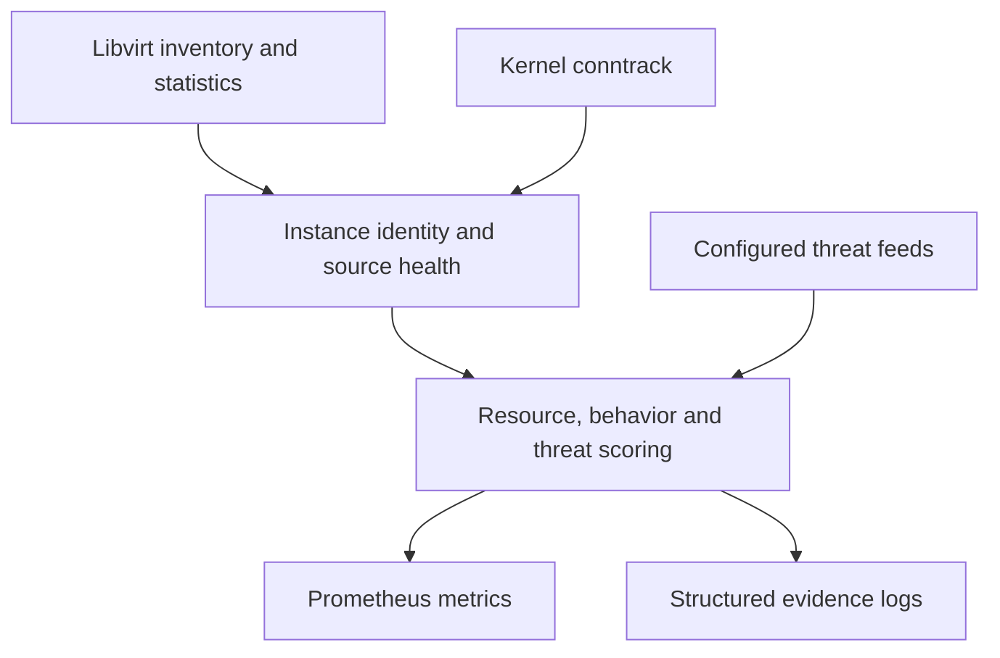

# OpenStack Instance Exporter (OIE)

OIE is a hypervisor-side Prometheus exporter for KVM/OpenStack. It combines **Libvirt resource statistics, kernel conntrack observations, threat-list matches and behavior scoring** to help operators investigate host pressure and instance activity.

Use it to investigate:

- *What a VM is doing to shared host resources* (CPU, memory, disk, and the kernel’s conntrack budget).
- *What a VM is doing on the network* (fan-out, destination-port breadth, and other behavioral evidence).

It does this **without an agent inside the tenant** and **without packet capture**.

**Version:** v2.0.0 · **Previous published release:** v1.2.0 · **Platform:** Linux amd64

## Start here

| I want to… | Read |
| --- | --- |
| Install or configure OIE | [Deployment](#deployment) and the [Ansible role guide](ansible_role/openstack_instance_exporter/README.md) |
| Upgrade an existing deployment | [v2.0.0 operator guide](OPERATOR_UPDATE.md) |
| Set up monitoring | [Grafana import guide](examples/grafana_dashboard_example/README.md) and [Prometheus rule installation](examples/prometheus_alerts_example/README.md) |
| Investigate a problem | [Runbooks](#operational-workflows-runbooks) and [troubleshooting](#troubleshooting) |
| Interpret a missing or retained value | [Source health](#fresh-retained-and-unavailable-data) and [measurement accuracy](ACCURACY_VALIDATION.md) |
| Look up a metric or flag | [Metric reference](#appendix-a-metric-reference) and [runtime defaults](#tuning-and-configuration) |
| Find a focused guide | [Documentation index](DOCUMENTATION.md) |

**On this page:** [Deploy and configure](#deploy-and-configure) · [Operate and troubleshoot](#operate-and-troubleshoot) · [Understand the data](#understand-the-data) · [Scoring and collection](#scoring-and-collection) · [Development and validation](#development-and-validation) · [Reference](#reference)

## Deploy and configure

### Deployment

The Ansible role installs a checksum-verified amd64 release and runs OIE as a root service for local Libvirt and raw conntrack access. Its installation, restart, systemd and cleanup safeguards are documented in [`DEPLOYMENT_HARDENING.md`](DEPLOYMENT_HARDENING.md).

#### Install with Ansible

Use the [role guide](ansible_role/openstack_instance_exporter/README.md) for prerequisites, the pinned release URL and checksum, local archive installation, and complete playbooks. The role manages the systemd service and configuration on each compute node.

For source builds, use Go **1.27.1** or newer. The bundled static Linux amd64 executable runs without Go on the compute node.

#### Enable behavior + threat lists (example)

After installing the executable, this example enables both behavior directions and the listed network feeds:

```bash
./openstack_instance_exporter \
  -collection.interval=15s \
  -outbound.behavior.enable=true \
  -inbound.behavior.enable=true \
  -behavior.sensitivity=2.0 \
  -spamhaus.enable=true \
  -tor.exit.enable=true \
  -tor.relay.enable=true \
  -emergingthreats.enable=true
```

#### Notes

- Intended deployment: **one exporter per compute node**.
- The repo includes an Ansible role for installation/configuration and systemd management — see the [Ansible role guide](ansible_role/openstack_instance_exporter/README.md) for role variables and examples.
- The [Prometheus alert example](examples/prometheus_alerts_example/README.md) uses the repository/OpenStack-Ansible templated variable format. Render it before installing it; do not load the example file directly as a native Prometheus rule file. It intentionally stays close to the single-group layout and keeps its expressions readable. The [Grafana dashboard examples](examples/grafana_dashboard_example/README.md) document import requirements and retained-data semantics.

### Compatibility

Designed with:

- **Architecture:** x86_64/amd64
- **OS:** Ubuntu 22.04 / 24.04
- **Hypervisor:** Libvirt 8.x–10.x, QEMU/KVM
- **Cloud:** OpenStack (OVN/OVS networking; **also works on Linux Bridge and OVS** — see conntrack zone notes)
- **Monitoring:** Prometheus 2.x/3.x for exporter scrapes; Grafana 12+ dashboards require the stable PromQL `@` modifier (Prometheus 2.33+). CI uses checksum-verified `promtool` 2.45.3 as its query compatibility baseline on both controller operating systems.

Dataplane notes:

- OVN gives the best attribution story because conntrack zones exist and allow safe disambiguation of overlapping tenant IPs.
- Linux Bridge/OVS is supported; without reliable zone context, overlapping IP environments can reduce uniqueness of per-instance attribution.

Intended deployment: one exporter per compute node.

### Permissions and security model

You need:

- Root, or an equivalent manually managed permission model that can access the local libvirt socket and raw conntrack Netlink interface.
- Optional outbound HTTPS for threat list fetching.
- Ability to bind on the listen address/port.

Security model:

- OIE runs outside tenants.
- The Ansible deployment runs OIE as root for direct local Libvirt and raw conntrack access.
- OIE does not capture payload; it avoids sensitive content storage by design.
- OIE produces triage signals; treat high scores as “investigate and mitigate”, not proof of compromise.
- OIE lets you keep telemetry and evidence in-house instead of relying on a paid service with opaque detection logic, forced data egress, or vendor lock-in.
- OIE is open source, so you can audit, modify, and self-host the full pipeline end-to-end.

### Tuning and configuration

Startup configuration now rejects invalid explicit intent instead of clamping, defaulting, or broadening it. Configured files and interfaces fail closed, the runtime log-level endpoint has strict read-versus-write methods and can be unregistered, and the production HTTP server bounds headers, idle connections, concurrent scrapes, and graceful shutdown without truncating valid large responses. The complete configuration and HTTP contract is recorded in [`CONFIGURATION_AND_HTTP.md`](CONFIGURATION_AND_HTTP.md).

OIE is designed so tuning maps to operator intent.

#### Core flags (common)

| Flag | Default | What it controls |
|---|---:|---|
| `behavior.sensitivity` | `1.0` | Behavior sensitivity from `0.1` through `10.0`, inclusive; values outside the range are rejected. |
| `behavior.ewma_fast_tau` | `3m` | Behavior EWMA **fast** time constant (baseline reacts quickly). |
| `behavior.ewma_slow_tau` | `2h` | Behavior EWMA **slow** time constant (baseline reflects long-term normal). |
| `threat.ewma_tau` | `2m30s` | Threat-list history EWMA time constant; must be greater than zero. |
| `behavior.ports_config` | `""` | Optional YAML: replace inbound/outbound monitored-port maps per direction. Built-ins are used only when unset; invalid configured files stop startup. |
| `behavior.rules_config` | `""` | Optional YAML: external behavior rules (table-driven heuristics + port sets). Missing or invalid configured files stop startup. |
| `collection.interval` | `15s` | Background collection interval. Supported range: `5s` through `1m`, inclusive. |
| `contacts.direction` | `"out"` | Default direction for threat/contacts: canonical `out`, `in`, `any`; existing `outbound`/`src` and `inbound`/`dst` aliases remain accepted. Invalid values are a startup config error (no silent fallback). |
| `host.threats.enable` | `false` | Enable host NIC/provider IP threat list checks if using ovn-bgp-agent.  |
| `host.interfaces` | `""` | CSV NIC whitelist used with `host.threats.enable`. When omitted while host threats are enabled, the default `bgp-nic` selection is used. |
| `host.ips.allow-private` | `false` | Include private IPs (provider/host threat checks). Useful for development/labs. |
| `inbound.behavior.enable` | `false` | Enable inbound behavior metrics. |
| `libvirt.uri` | `"qemu:///system"` | Libvirt URI. |
| `volume.retype.enable` | `false` | Enable attached-volume retype discovery, progress polling and lifecycle metrics. Libvirt collection safety checks remain active with either setting. |
| `log.file.enable` | `false` | Enable file logging. |
| `log.file.path` | `"/var/log/openstack_instance_exporter.log"` | Log file path. |
| `log.level` | `"info"` | `debug`, `info`, `warn`, `notice`, or `error` (trimmed and case-insensitive; `notice` aliases `warn`). Invalid explicit values stop startup. |
| `threat.log.min_interval` | `5m` | Minimum interval between repeated threat-list and policy notice logs. Behavior events use their own persistence, transition, cooldown, and heartbeat lifecycle. |
| `outbound.behavior.enable` | `false` | Enable outbound behavior metrics. |
| `severity.weight.behavior` | `0.45` | Finite non-negative weight: behavior anomalies. The three severity weights may not all be zero. |
| `severity.weight.resource` | `0.45` | Finite non-negative weight: resource pressure. The three severity weights may not all be zero. |
| `severity.weight.threat_list` | `0.10` | Finite non-negative weight: threat list matches. The three severity weights may not all be zero. |
| `web.debug-log-level.enable` | `true` | Register `/debug/log-level`; `false` leaves the endpoint unregistered. GET is read-only and only a valid POST changes the level. |
| `web.listen-address` | `"0.0.0.0:9120"` | Address to listen on. |
| `web.telemetry-path` | `"/metrics"` | Path under which to expose metrics. |
| `worker.count` | `0` | `0` through `64`; `0` selects NumCPU capped at `64`, while `1` through `64` are exact. |
| `conntrack.raw.rcvbuf_bytes` | `33554432` | SO_RCVBUF bytes for the raw conntrack reader |
| `conntrack.raw.rcv_timeout` | `15s` | SO_RCVTIMEO timeout for the raw conntrack reader |
| `conntrack.ipv4.enable` | `true` | Enable IPv4 conntrack reads |
| `conntrack.ipv6.enable` | `true` | Enable IPv6 conntrack reads |

The HTTP server uses a `10s` read-header timeout, `2m` idle timeout, 32 KiB maximum-header setting, four concurrent metrics requests, and a `10s` graceful-shutdown deadline. `WriteTimeout` is deliberately disabled so a valid large or slow Prometheus scrape is not cut off.

#### Threat list flags (common)

| Flag | Default | Purpose |
|---|---:|---|
| `spamhaus.enable` | `false` | Enable the Spamhaus DROP list provider. |
| `spamhaus.url` | `"https://www.spamhaus.org/drop/drop.txt"` | Spamhaus IPv4 DROP source URL. |
| `spamhaus.ipv6.url` | `"https://www.spamhaus.org/drop/dropv6.txt"` | Spamhaus IPv6 DROP source URL. |
| `spamhaus.refresh` | `6h` | Refresh interval for Spamhaus. |
| `spamhaus.direction` | `""` | Direction override for Spamhaus. Supported values: `out`, `in`, `any`. Empty inherits `contacts.direction` (`out` by default). Invalid values are a startup config error. |
| `tor.exit.enable` | `false` | Enable the Tor **exit** list provider. |
| `tor.exit.url` | `"https://onionoo.torproject.org/details?search=flag:exit&fields=or_addresses"` | Tor exit source URL (Onionoo). |
| `tor.exit.refresh` | `1h` | Refresh interval for Tor exit. |
| `tor.exit.direction` | `""` | Direction override for Tor exit. Supported values: `out`, `in`, `any`. Empty inherits `contacts.direction` (`out` by default). Invalid values are a startup config error. |
| `tor.relay.enable` | `false` | Enable the Tor **relay** list provider. |
| `tor.relay.url` | `"https://onionoo.torproject.org/details?search=flag:running&fields=or_addresses"` | Tor relay source URL (Onionoo). |
| `tor.relay.refresh` | `1h` | Refresh interval for Tor relay. |
| `tor.relay.direction` | `""` | Direction override for Tor relay. Supported values: `out`, `in`, `any`. Empty inherits `contacts.direction` (`out` by default). Invalid values are a startup config error. |
| `emergingthreats.enable` | `false` | Enable the Emerging Threats list provider. |
| `emergingthreats.url` | `"https://rules.emergingthreats.net/blockrules/compromised-ips.txt"` | Emerging Threats source URL. |
| `emergingthreats.refresh` | `6h` | Refresh interval for Emerging Threats. |
| `emergingthreats.direction` | `""` | Direction override for Emerging Threats. Supported values: `out`, `in`, `any`. Empty inherits `contacts.direction` (`out` by default). Invalid values are a startup config error. |
| `customlist.enable` | `false` | Enable the local custom list provider. |
| `customlist.path` | `""` | Path to a newline-delimited list of IPs/CIDRs. |
| `customlist.refresh` | `10m` | Reload interval for the custom list file. |
| `customlist.direction` | `""` | Direction override for the custom list. Supported values: `out`, `in`, `any`. Empty inherits `contacts.direction` (`out` by default). Invalid values are a startup config error. |

#### Practical tuning strategy

- Start with outbound behavior enabled and sensitivity 1.0.
- Add inbound behavior if you run public services and want inbound spray visibility.
- Start with Spamhaus first for high confidence.
- Add Tor lists if policy requires it.
- Add EmergingThreats if you accept higher false positive risk.
- Keep threat weight lower until you have tuned noise.

### nf_conntrack_acct: bytes/packets per flow

Some behavior features require conntrack accounting (`nf_conntrack_acct=1`):

- `*_bytes_per_flow`
- `*_packets_per_flow`

If accounting is disabled:

- OIE still exports flows/ports/remotes and scores behavior.
- Bytes/packets features are omitted.
- Accounting-based detections do not activate.

How to enable (common):

- `sysctl -w net.netfilter.nf_conntrack_acct=1` (temporary)
- Add `net.netfilter.nf_conntrack_acct=1` to `/etc/sysctl.conf` or `/etc/sysctl.d/*.conf` (persistent)

Note:

- Accounting adds extra work in kernel per flow.
- Validate overhead on your busiest compute nodes.

## Operate and troubleshoot

### Dashboards and alerts

The v2.0.0 alert policy contains 82 definitions with 33 enabled by default and ten shared recording rules. The rendered one-group policy is tested for source health, persistence, recovery and incident identity. The complete Prometheus alert policy is documented in [`PROMETHEUS_ALERTS.md`](PROMETHEUS_ALERTS.md).

The operational examples provide one group with 33 default alerts, 49 opt-in diagnostics and shared recording rules, an Ansible role with the versioned GitHub download URL and verified archive checksum defined by default, plus a local controller archive override. The operator update adds inactive inventory, while Threat List Overview retains its full per-feed and long-window investigation charts. The operational-configuration contract is recorded in [`OPERATIONAL_CONFIGURATION.md`](OPERATIONAL_CONFIGURATION.md).

The five Grafana dashboards and operator documentation are now audited against the final metric names, types, labels, units, source-availability semantics, runtime defaults, and 82-definition operator alert pack. Dashboard PromQL and alert selectors are checked against the current 148-family schema; views distinguish fresh, retained, and unavailable data and describe behavior, threat-list, and mining signals as evidence rather than proof. The complete dashboard and documentation contract is recorded in [DASHBOARDS_AND_DOCUMENTATION.md](DASHBOARDS_AND_DOCUMENTATION.md).

### Operational workflows (runbooks)

#### Conntrack saturation before it becomes an outage

- Watch `oie_host_conntrack_utilization` per compute node.
- When it climbs, pivot to top per-instance fixed-IP flow pressure:
  - `oie_instance_conntrack_ip_flows`
  - inbound/outbound splits.
- Correlate with behavior features:
  - `*_unique_dst_ports` spikes → destination-port breadth worth investigating.
  - `*_unique_remotes` spikes → remote fan-out worth investigating.
  - `*_max_flows_single_dst_port` spikes → pressure on a specific service port.
- Remediate at the cloud edge:
  - isolate, rate-limit, quarantine via Neutron policy/security groups.

#### “The cloud is slow on this host”

- Check host pressure: `oie_host_cpu_usage_percent` and host memory metrics.
- Find contention:
  - high `oie_instance_cpu_steal_seconds_total` → scheduler contention.
  - high `oie_instance_cpu_wait_seconds_total` → scheduler contention when the preferred delay counter is unavailable; it is not guest I/O wait.
- Confirm I/O pressure:
  - rising disk service time + rising requests.
- Confirm network pressure:
  - rising packets + elevated `oie_instance_conntrack_ip_flows`.

#### Threat intel hits you can automate

- Enable lists you trust (Spamhaus first).
- Use active-flow pressure and contact presence:
  - active flows = now
  - contact rate = repeated touches
- Drive automation off severities with instance UUID as handoff key.

#### FinOps right-sizing (“reserved vs used”)

- Use allocated vs used memory to identify chronic over-reservation.
- Aggregate by project/user labels to generate showback/chargeback.

### Troubleshooting

#### No conntrack metrics?

- Check `oie_host_conntrack_read_errors_total`.
- Check exporter logs for conntrack read failures.
- Ensure required privileges are present.
- Check raw reader health: `oie_host_conntrack_raw_ok` and `oie_host_conntrack_stale_seconds`.

#### Some instances missing fixed-IP attribution?

- OIE attributes by fixed IP (and zone when available).
- Instances without discoverable fixed IPs won’t get conntrack attribution.
- Check `oie_host_active_fixed_ips` and `oie_instance_info`.

#### Some per-instance conntrack attribution looks “too low” on Linux Bridge / OVS?

- If you have overlapping tenant IPs and no usable zone context, OIE may not be able to uniquely map every flow to a single instance identity.
- Host conntrack utilization remains correct; per-instance splits can be degraded by ambiguity.

#### High label cardinality concerns?

- Treat `oie_instance_info` as metadata; do not alert on `*_info`.
- Use `max by (...)` in dashboards/alerts when collapsing fan-out labels (if you add rules in your repo).

#### Threat lists failing to refresh?

Enabled Tor exit, Tor relay, Emerging Threats, custom-file and Spamhaus feeds share one refresh scheduler. With a positive refresh interval, a failed initial load or later refresh retries after 30 seconds, then 1, 2, 4 and 5 minutes, capped at 5 minutes; a shorter configured interval remains the upper bound. Each delay starts after the previous attempt completes. Success resets the retry delay and resumes the configured normal interval. Explicit startup-only configurations (`refresh <= 0`) retain their single-attempt behavior. Pending retry waits stop promptly on exporter shutdown. No additional flags or Ansible variables are required.

HTTP failures identify known timeout, DNS, TLS certificate, connection-refusal/reset, unreachable-host and truncated-response causes without printing configured URLs, query tokens or proxy credentials. HTTP status errors retain their numeric status. Unclassified transport failures keep the generic request-failed message. Custom-file failures retain their existing file/parser diagnostics. Failed loads never advance the last-success timestamp or extend snapshot freshness; Spamhaus publishes only after every configured address family succeeds.

- Watch refresh error counters and last-success timestamps.
- Confirm HTTPS egress and DNS.
- Confirm customlist path permissions if using `customlist.path`.

### Logging and evidence

#### Unified logging

All engines (resource, conntrack, behavior, threat) emit **JSON lines** into the same log stream/file.

* There is **no separate threat log file**.
* Threat hits (when threat lists are enabled) are emitted as normal log events into the main log (with the same cadence controls: min-interval / de-dup).
* This makes Loki/Grafana, grep, and incident timelines simpler: one source of truth.

Metrics drive dashboards and alerts.
Logs provide evidence and incident context.

OIE logs:

- Structured JSON for reliable machine parsing.
- Log level controlled by `-log.level`.
- Optional file logging controlled by `-log.file.enable`.
- Threat hits and behavior alerts are **log events in the same stream** (unified logging).
- Set the log level to `info` to retain behavior and resource insights without debug-level volume.

#### Threat-hit event throttling

Threat-list contacts can be bursty during repeated traffic. OIE throttles and
deduplicates threat-hit events to preserve evidence without unbounded log growth.

#### Loki compatibility

OIE’s logs are designed to be Loki-friendly out of the box:

- JSON per line.
- Consistent keys (`msg`, `level`, `time`, plus identity keys like `instance_uuid`, `project_uuid`, `user_uuid`, `direction`, etc.).
- High-cardinality stays in log *fields*, not log *labels*.

### FAQ

- **Is this a replacement for Suricata/Zeek?** No. It is not DPI. It is a host-side telemetry and IDS-signal layer.
- **Will this explode Prometheus cardinality?** Not if you keep defaults. It avoids remote-IP labels and bounds state.
- **Can tenants hide from it?** OIE does not inspect payload. It sees only host-visible Libvirt and conntrack state, so encryption, asymmetric routing, offload, telemetry gaps, and ambiguous identity mapping can limit evidence.
- **What’s the biggest stability win?** Host conntrack pressure plus per-instance attribution can identify contributing instances when fixed-IP and zone mapping is unambiguous.
- **Does it work with OVN/OVS and Linux Bridge?** Yes. OVN is best. Linux Bridge/OVS works but zone-less overlap can reduce uniqueness of per-instance attribution.

## Understand the data

- [What problem this solves](#what-problem-this-solves)
- [What gaps it fills](#what-gaps-it-fills)
- [Signals at a glance](#signals-at-a-glance)
- [Architecture](#architecture)
- [Data sources and why they matter](#data-sources-and-why-they-matter)
- [Identity model and label strategy](#identity-model-and-label-strategy)
- [Zero agents, zero packet capture](#zero-agents-zero-packet-capture)

### What problem this solves

OpenStack gives you scheduling, quotas, and API-level telemetry.
It does **not** give you hypervisor-grade answers to questions like:

- Which tenant VM is about to exhaust the host conntrack table?
- Which VM has outbound destination-port breadth consistent with scanning activity?
- Which project is reserving 1 TB of RAM but using 80 GB?
- Why is “the cloud slow” on this host right now (CPU steal vs disk service time vs flow pressure)?

OIE fills that gap with **per-VM attribution** from host-visible Libvirt and conntrack observations when identity mapping is unambiguous.

### What gaps it fills

Think of OIE as the missing middle layer between:

- **Control-plane telemetry** (Nova/Neutron/Cinder events, quotas, API counters).
- **Host-only telemetry** (node exporter / process exporter).
- **Packet capture IDS** (Suricata/Zeek), which is powerful but expensive.

OIE’s niche is:

- **Attribution:** turn host and kernel reality into *per-instance* metrics (instance UUID + project/user ownership).
- **Lightweight IDS signals:** anomaly + heuristic detection from conntrack state (not payload).
- **Operational triage:** provide a single “attention” signal that blends resource + behavior + threat-list signals.
- **TSDB safety:** stay low-cardinality (no remote-IP labels) and bounded state.

OIE is for providers and operators who need *actionable answers* without deploying an agent or standing up a capture pipeline.

### Signals at a glance

| Signal | What it helps investigate | Read alongside |
| --- | --- | --- |
| Resource severity | CPU, memory, disk or network pressure on an instance | Per-axis freshness and the underlying measurements |
| Conntrack usage | Consumption of the host connection-tracking budget | Fixed-IP ownership and zone attribution |
| Behavior severity | Deviations from an instance's network baseline and matching heuristics | Evidence kind, direction, persistence and workload context |
| Threat-list severity | Active flows and contacts matching configured lists | Feed health, direction and source quality |
| Attention severity | Combined resource, behavior and threat evidence | Component scores and their availability |

Scores support investigation. They do not establish malicious intent or identify a responsible workload by themselves.

### Architecture

OIE runs on the **compute node** and collects:

- **Libvirt domain inventory + stats** (CPU, memory, disks, NICs, state).
- **Kernel conntrack table** to attribute flow pressure to instances (by fixed IP; and by conntrack zone when available).
- **Threat list matchers** (Spamhaus CIDRs + IP lists like Tor Exit/Relay, EmergingThreats, Custom).
- **Behavior engine** (fast/slow EWMA + heuristics) per *(instance, fixed IP, direction)* for anomaly and abuse indicators.

#### Dataflow diagram



OIE is intentionally **not** a packet capture IDS.
It is a *host-side telemetry and IDS-signal layer*.

### Data sources and why they matter

#### Libvirt: the VM’s resource telemetry

Libvirt tells you:

- Which domains exist and are active.
- CPU time and vCPU allocation.
- Guest memory usage signals (where available).
- Disk service time and request counters.
- NIC byte/packet counters and errors/drops.

This is what lets OIE attribute **host-side resource consumption** to **tenant instances**.

#### Fresh, retained, and unavailable data

OIE treats source health as part of the metric value. A complete source read is **fresh**. A failed read after at least one complete success is **retained**: the exporter keeps the last-good dependent values, marks the source unhealthy, and lets stale age increase. A failed read before the first complete success is **unavailable**: dependent values are omitted instead of being published as healthy zeroes.

Libvirt collection is atomic across the domain list and the metadata required for every returned domain. One domain or metadata failure rejects the whole cycle. On the supported local-QEMU deployment, the stats-and-metadata snapshot is also bracketed by QEMU process-incarnation tokens derived from the host boot ID, PID, `/proc` start time, and exact domain UUID.

For active domains a missing, duplicate, or changing token rejects the cycle; inactive definitions require no QEMU process before or after the snapshot; a changed stable token clears old rate and resource state even if Libvirt reused the same numeric domain ID. Conntrack retention is restricted to the same `(instance UUID, fixed IP)` identity, and an incomplete read does not advance behavior EWMA, persistence, mining state, cooldowns, or evidence events.

Recovery silently establishes the first complete behavior observation as a new statistical baseline; persistence resumes with the next complete interval, so the outage itself cannot create a workload spike or alert. The bundled operator alert policy uses target-local Libvirt and conntrack health to prevent retained samples from qualifying workload alerts.

The live Libvirt health gauges below distinguish fresh from retained data even while last-good workload metrics are being served. The complete data-integrity contract is recorded in [`DATA_INTEGRITY.md`](DATA_INTEGRITY.md).

#### Conntrack: the VM’s network state

Conntrack tells you:

- How many flows exist.
- Direction (VM as source vs VM as destination).
- Reply-seen / assured signals (useful for unreplied ratio).
- Optional bytes/packets per flow if `nf_conntrack_acct=1`.
- (When available) the conntrack **zone**, which is the key to safe attribution in a multi-tenant overlay world.

This is what lets OIE attribute:

- **Host conntrack budget consumption** (shared blast radius).
- **Scanning and fan-out** patterns without packet capture.
- **Overlapping IP** environments safely (zone-first attribution).

#### Threat intel: configured-list match evidence

Threat intel lists tell you:

- Whether remote IPs involved in flows are on curated lists.
- How often an instance touches those lists (contacts).
- Whether it is actively touching them right now (active flows pressure).

#### EWMA: deviation from self-baseline

Fast/slow EWMA tells you:

- What “normal” looks like for *this exact identity*.
- Whether the current interval is a burst, drift, or stable.

This avoids a common operational failure mode: global static thresholds that
page constantly in busy environments while missing low-volume anomalous behavior.

### Identity model and label strategy

OIE uses identity labels because you cannot operate a cloud without ownership.
Metrics without identity create endless “who owns this?” churn.

#### Standard label sets (practical)

- **Instance base metrics:** `domain, server_name, instance_uuid, project_uuid, project_name, user_uuid`
- **Instance metadata (`oie_instance_info`):** base labels + `user_name, flavor, vcpus, mem_mb, root_type, created_at, metadata_version`
- **Instance state code (`oie_instance_state_code`):** base labels + `state_desc`
- **Instance conntrack IP metrics:** `domain, server_name, instance_uuid, project_uuid, project_name, user_uuid, ip, family`
- **Persisted mining-suspicion metric:** base labels + `ip, family, port, port_name, confidence, priority`
- **Instance disk metrics:** base labels + `volume_uuid, disk_type, disk_path`
- **Instance NIC metrics:** base labels + `ifname`
- **Per-vCPU counters:** base labels + `vcpu`
- **Instance severity metrics:** `domain, server_name, instance_uuid, project_uuid, project_name, user_uuid`
- **Threat contact / active-flow metrics (direction-aware):** `domain, server_name, instance_uuid, project_uuid, project_name, user_uuid, direction`
- **Threat-list severity metric:** `domain, server_name, instance_uuid, project_uuid, project_name, user_uuid`

#### Why IDs and names together

- UUIDs are stable keys for automation and incident response.
- Names are human-friendly for dashboards and triage.
- You need both for operators to move quickly without copying/pasting from a separate lookup system.

#### Why fixed IP mapping is the right bridge

Conntrack is keyed by IPs and ports.
By attributing flows to fixed IPs owned by a VM:

- You can identify the exact instance causing conntrack pressure.
- You can split inbound vs outbound behavior.
- You can keep cardinality bounded (fixed IP count is bounded by your inventory).

When conntrack **zones** are available, OIE uses **zone-first attribution** to make this safe even when multiple tenant networks reuse the same RFC1918 address space.

#### Cardinality rules (non-negotiable)

- Host metrics: single series per host.
- Instance metrics: linear with instance count.
- Conntrack IP metrics: linear with fixed IP count.
- Behavior features: per *(instance, fixed IP, direction)* identity and bounded by caps.
- `*_info` series: metadata fan-out by design; treat as metadata, not alert triggers.

### Zero agents, zero packet capture

OIE’s principle is simple:

- If the compute node already has the required data, don’t duplicate it inside the tenant.
- If the kernel already tracks state, don’t mirror packets and parse payload unless you truly need DPI.

#### What OIE does not do (by design)

- No packet capture.
- No TCP stream reassembly.
- No signature scanning over payload.
- No per-flow time series.
- No remote-IP labels in Prometheus.

#### Why this matters (Suricata/Zeek comparison)

Suricata class tooling is powerful, but expensive:

- Packet copy from kernel to userland at scale is heavy.
- DPI engines can consume significant CPU per Gbps.
- Storing pcap/events can be large and sensitive.
- Per-flow event streams can become operationally noisy.

OIE is designed to be:

- **Default-on** across your entire compute fleet.
- **Predictable** in overhead (bounded state + low cardinality).
- **Actionable** for infra operators (conntrack blast radius + ownership labels).

## Scoring and collection

- [Resource engine](#resource-engine)
- [Conntrack engine: shared blast radius](#conntrack-engine-shared-blast-radius)
- [Behavior engine: EWMA anomaly IDS + heuristics](#behavior-engine-ewma-anomaly-ids--heuristics)
- [Threat intelligence engine](#threat-intelligence-engine)
- [Scoring model](#scoring-model)
- [Attention score: how the severities combine](#attention-score-how-the-severities-combine)
- [Noisy neighbors: host pressure to per-instance attribution](#noisy-neighbors-host-pressure-to-per-instance-attribution)
- [Cardinality, scaling, and TSDB safety](#cardinality-scaling-and-tsdb-safety)
- [Performance and overhead](#performance-and-overhead)
- [Attached-volume retype monitoring](#attached-volume-retype-monitoring)

### Resource engine

Resource scoring applies the same availability model independently to the `cpu`, `mem`, `disk`, and `net` axes. A missing axis sample never becomes a zero. The previous axis severity is retained without advancing its EWMA or composite persistence for at most eight collection intervals. Recovery within the two-interval missing-sample grace resumes over one normal interval; recovery after the grace silently reinitializes the axis so the gap cannot create a spike.

Once the retained age exceeds eight intervals, the axis is unavailable, omitted from the composite, and its severity metric is no longer emitted. Non-finite observations are missing samples, not valid zeroes. After a live vCPU or memory-maximum dimension has appeared, its later absence retains the affected axis and rate baseline; flavor metadata is not substituted for the missing live dimension.

| Axis state | `oie_instance_resource_axis_fresh` | `oie_instance_resource_axis_available` | Last success | Stale age | Axis severity |
| --- | ---: | ---: | ---: | ---: | --- |
| No successful sample | `0` | `0` | `0` | `-1` | Omitted |
| Fresh | `1` | `1` | Current sample time | Age since current sample | Current value |
| Retained | `0` | `1` | Unchanged | Increases | Last-good value |
| Unavailable after retention expires | `0` | `0` | Unchanged | Increases | Omitted |

All four state gauges use the normal instance identity labels plus `axis`. Strict site-specific per-axis rules should require the matching axis to be fresh. Strict overall resource, attention, and project-hot rules should require at least one available axis and require every available axis to be fresh, so retained values remain observable without starting or extending a workload alert. The bundled operator policy applies these freshness checks through shared recording rules.

The complete resource-telemetry contract is recorded in [`RESOURCE_TELEMETRY.md`](RESOURCE_TELEMETRY.md).

The resource engine answers:

- “Which VM is consuming shared host resources *in a way that matters*?”
- “Which VM is likely impacting other tenants on the same host?”

The resource engine produces:

- `oie_instance_resource_severity`
- `oie_instance_resource_cpu_severity`
- `oie_instance_resource_mem_severity`
- `oie_instance_resource_disk_severity`
- `oie_instance_resource_net_severity`

#### Core idea: Pressure × Confidence × Impact

Each axis computes:

- **Pressure (P):** the current push (0..1).
- **Confidence (C):** how trustworthy the pressure sample is (0..1).
- **Impact (I):** how much this VM matters (0..1), scaled by “size” (vCPU count, memory allocation, etc.).

The axis severity is derived from these components and smoothed over time.

#### Smoothing: rise vs fall time constants (anti-flap)

The resource engine uses different time constants for:

- Rising pressure (react quickly).
- Falling pressure (cool down slowly).

This reduces:

- Alert flapping.
- Dashboard noise.
- “Everything is always in crisis” syndrome.

#### Persistence: guarding the top of the scale

A common failure mode is:

- Everything “bad” instantly becomes 100.
- Operators lose nuance.

The resource engine uses persistence and multi-axis checks to allow “very high” only when justified:

- If multiple axes are severe simultaneously, very high is justified.
- If one axis stays severe for multiple cycles, very high becomes justified.
- Otherwise, a single spike is visible but not automatically “100”.

#### Axis notes (operator-level meaning)

CPU axis:

- High CPU usage is not automatically “bad” if the host is healthy.
- CPU becomes “bad” when it correlates with contention signals and host pressure.

Memory axis:

- Allocated vs used reveals waste and overcommit risk.
- RSS reveals actual host RAM consumed.
- Swap and faults can indicate memory stress.

Disk axis:

- Service time is the “pain” metric.
- Requests/IOPS explain volume.
- High service time + high requests indicates I/O bottleneck.

Network axis:

- Bytes/packets show volume.
- Drops/errors show pain.
- Conntrack flows show kernel state pressure (blast radius).

#### Resource engine scope

- It is not a micro-benchmark tool.
- It is not a per-device storage profiler.
- It is not a replacement for deep host tuning.

It is a “who is causing pressure?” attribution engine.

### Conntrack engine: shared blast radius

Conntrack is a host-wide table.
One tenant can exhaust it and break networking for everyone.

Host conntrack metrics:

- `oie_host_conntrack_entries`

- `oie_host_conntrack_raw_ok` (gauge): `1` if the raw conntrack reader succeeded on the last run, else `0`
- `oie_host_conntrack_raw_enobufs_total` (counter): total ENOBUFS errors encountered by the raw conntrack reader
- `oie_host_conntrack_raw_parse_errors_total` (counter): total parse errors encountered by the raw conntrack reader
- `oie_host_conntrack_last_success_timestamp_seconds` (gauge): unix timestamp of last successful conntrack read (seconds)
- `oie_host_conntrack_stale_seconds` (gauge): seconds since the last successful conntrack read; `-1` before the first success
- `oie_host_conntrack_max`
- `oie_host_conntrack_utilization`

Per-instance flow attribution:

- `oie_instance_conntrack_ip_flows`
- `oie_instance_conntrack_ip_flows_inbound`
- `oie_instance_conntrack_ip_flows_outbound`

#### Why conntrack is the right “blast radius” signal

- It reflects kernel state consumption, not just bandwidth.
- Low bandwidth scans can still explode conntrack.
- When conntrack fails, symptoms look like “random timeouts” and “cloud outage”.

#### How to operate with conntrack

- Watch host utilization.
- When it rises, pivot to per-instance IP flows.
- Determine whether the observed pressure is inbound or outbound, then use tenant and network context to establish cause.
- Mitigate accordingly.

#### Mitigation levers (real cloud ops)

- Neutron security groups (block egress, restrict ports, lock down).
- Quarantine network (move VM / detach / isolate).
- Edge ACLs and rate limits (contain reviewed traffic quickly).
- Increase conntrack max only with careful memory planning.

#### OVN, conntrack zones, and dataplane compatibility

OIE’s conntrack attribution is designed around a hard reality: **tenant IP overlap is normal**.

In OVN deployments, overlapping RFC1918 spaces are separated in the dataplane using conntrack zones (and related logical pipeline metadata). When those zones are visible in the conntrack snapshot, OIE uses a **zone-first** attribution path:

- Zone → identify the tenant context
- Then fixed-IP → map to instance identity

Overlapping fixed IPs can be attributed when the current zone-to-port mapping and Libvirt metadata identify the owning instance. A visible zone alone is insufficient.

##### OVN / OVN+OVS

- **Best case for attribution.**
- Conntrack zones exist and are meaningful.
- OIE can disambiguate overlap when zone, port and fixed-IP identity agree.
- Per-instance counts identify observed contributors when that mapping is available.

##### Linux Bridge / legacy OVS without usable zones

OIE still works and still exports:

- Host conntrack utilization and health metrics.
- Per-instance fixed-IP flow attribution **when IPs are unique on-host**.
- Behavior features and severities off observed flows.

However:

- If the host sees **overlapping tenant IPs** (common in large fleets), and there is **no reliable zone context**, attribution can become ambiguous.
- Endpoints without a unique zone or on-host fixed-IP owner remain unattributed. Host totals remain visible; missing identity is not assigned to an arbitrary tenant.

Attribution depends on host-visible conntrack data and usable identity mappings. OVN zones improve overlap resolution; they do not establish complete or perfect attribution.

#### Raw conntrack reader

OIE uses a purpose-built **raw conntrack reader** that talks to the kernel via Netlink and parses into a compact in-memory representation (minimizing per-flow allocations and string conversions).

Important operational facts:

- **Raw is the only conntrack backend**.
- There is **no fallback** to a different reader.
- If the raw reader fails after a complete success, exact-identity conntrack-derived values are retained without advancing derived state. Before the first complete success those dependent values are unavailable and omitted. The health metrics below expose either condition immediately.

This is controlled by:

- `-conntrack.raw.rcvbuf_bytes=<bytes>` (default: `33554432` / 32 MiB)
  Sets the socket **SO_RCVBUF** for the raw reader. Too small can cause **ENOBUFS** under heavy tables.

- `-conntrack.ipv4.enable` (default: `true`)
- `-conntrack.ipv6.enable` (default: `true`)

> Note: raw is an implementation choice for performance and determinism. The semantics are “conntrack snapshot → attribution → features” regardless of dataplane.

#### Raw conntrack reader health metrics

The raw reader exposes host-level “health” telemetry so you can detect when you’re dropping/losing visibility:

- `oie_host_conntrack_raw_ok` (gauge): `1` if the last raw read succeeded, else `0`
- `oie_host_conntrack_raw_enobufs_total` (counter): ENOBUFS occurrences encountered by the raw reader
- `oie_host_conntrack_raw_parse_errors_total` (counter): parse errors encountered by the raw reader
- `oie_host_conntrack_last_success_timestamp_seconds` (gauge): unix timestamp of the last successful conntrack read
- `oie_host_conntrack_stale_seconds` (gauge): seconds since the last successful conntrack read; `-1` before the first success

These are intentionally **host-level** only (no extra labels) so they remain low-cardinality.

#### Raw reader socket buffer sizing

The single biggest tuning knob for the raw reader is **SO_RCVBUF** (`-conntrack.raw.rcvbuf_bytes`). If it’s too small, the kernel can drop Netlink messages under load and you’ll see ENOBUFS.

Pragmatic starting points:

| Conntrack table size (rough) | Suggested `conntrack.raw.rcvbuf_bytes` |
|---:|---:|
| < 250k entries | 33554432 (32 MiB) |
| 250k – 1M entries | 67108864 (64 MiB) |
| 1M – 2M entries | 134217728 (128 MiB) |
| 2M+ entries | 268435456 (256 MiB) |

If you increase SO_RCVBUF, you may also need to raise host limits:

- `net.core.rmem_max`
- `net.core.rmem_default`

OIE does **not** change these sysctls for you; set them in your node baseline if you want larger buffers. Likely will not need to change.

### Behavior engine: EWMA anomaly IDS + heuristics

Behavior persistence requires both consecutive complete qualifying collections and real eligible elapsed time. Incomplete cycles freeze behavior and mining state, while complete clean or changed evidence and exact instance-lifecycle boundaries reset it. Mining independently qualifies one public, replied remote-IP/port pair, so a generic first match cannot suppress mining and a shared port alone cannot produce a warning; after confirmation, the old endpoint remains visible until a replacement endpoint independently requalifies. Here, confirmation means the exporter's internal evidence gate, not proof that mining occurred. The complete behavior-and-mining contract is recorded in [`BEHAVIOR_AND_MINING.md`](BEHAVIOR_AND_MINING.md).

Behavior engine helps answer:

- “Is this VM’s network behavior normal for itself?”
- “Is it suddenly scanning, fanning out, or receiving a spray of inbound probes?”
- “Does its visible state match policy-relevant patterns?” (mail fan-out, mining-port evidence, public admin exposure, and similar signals.)

#### Key properties

- Identity: *(instance UUID, fixed IP, direction)*.
- Inputs: conntrack snapshot-derived features (flows, ports, remotes, unreplied, optional acct bytes/packets).
- Method: fast/slow EWMA + heuristic classification.
- Output: metrics + severity + structured logs with evidence.

#### What this is (and what it is not)

**What it is:**

- A hypervisor-side **behavior evidence and IDS-signal layer**.
- It scores deviations from self-baseline (EWMA) and classifies evidence when documented gates pass.
- It produces explainable alerts with stable evidence keys.

**What it is not:**

- Not DPI.
- Not Suricata rules.
- Not payload inspection.
- Not a signature feed that needs constant tuning.

#### New behavior system: EWMA + heuristic “kinds”

The behavior engine emits an alert `kind` (category) when detection gates pass. Kinds are designed to be:

- few and operator-readable (not hundreds of signatures)
- evidence-first (you can explain the alert from the log line)
- conservative (persistence + cooldown to reduce noise)

Examples of kinds (direction-aware):

- **Vertical port scan**: many destination ports, concentrated remotes low, high unreplied.
- **Horizontal scan / fan-out**: many remotes, smaller port spread, high unreplied.
- **Dark-space**: traffic to ports outside the monitored port list (“should never happen” signal).
- **Public admin exposure** (inbound): inbound to high-risk admin ports with meaningful remote breadth.
- **SMTP fan-out evidence** (outbound): sustained outbound to mail ports with high remote fan-out.
- **Mining/Stratum behavior** (outbound): persistent replied TCP flows to the tiered built-in mining-pool port catalogue.
- **DNS tunneling indicators** (outbound): UDP/53 with abnormal bytes-per-flow and low reply ratio (acct required).
- **Control-plane probing evidence**: patterns consistent with BGP/Geneve probing and metadata-service access (when enabled by the build/config).

(Exact kind names are implementation-defined; the goal is stable semantics rather than an oversized rule set.)

#### Why fast+slow EWMA matters

- Fast EWMA responds to bursts.
- Slow EWMA models baseline.
- The gap between them measures the magnitude of the current deviation.

#### Behavior feature metrics (exported)

Inbound:

- `oie_instance_inbound_flows`
- `oie_instance_inbound_unique_remotes`
- `oie_instance_inbound_new_remotes`
- `oie_instance_inbound_unique_dst_ports`
- `oie_instance_inbound_new_dst_ports`
- `oie_instance_inbound_max_flows_single_remote`
- `oie_instance_inbound_max_flows_single_dst_port`
- `oie_instance_inbound_bytes_per_flow` (acct required)
- `oie_instance_inbound_packets_per_flow` (acct required)

Outbound:

- `oie_instance_outbound_flows`
- `oie_instance_outbound_unique_remotes`
- `oie_instance_outbound_new_remotes`
- `oie_instance_outbound_unique_dst_ports`
- `oie_instance_outbound_new_dst_ports`
- `oie_instance_outbound_max_flows_single_remote`
- `oie_instance_outbound_max_flows_single_dst_port`
- `oie_instance_outbound_bytes_per_flow` (acct required)
- `oie_instance_outbound_packets_per_flow` (acct required)

Persisted mining-suspicion state:

- `oie_instance_mining_suspected` (value `1` after the internal persistence gate; labels include `port`, `port_name`, `confidence`, and `priority`)

#### Remote breadth semantics (important)

Remote breadth is intentionally **bounded for scoring stability**:

- `*_unique_remotes` and `*_new_remotes` are exported as **saturating counts capped at 32768**. Once they hit 32768, the published value stays at 32768 by design.
- Behavior alert logs expose `unique_remotes_saturated=true` and `new_remotes_saturated=true` when that happens.
- Internal per-identity remote tracking stays exact up to **32768 distinct remote IPs** in the current analysis window. Beyond that, the exporter stays functional but remote-dominance / remote-history details become bounded and approximate.
- In that extreme case, `*_max_flows_single_remote` is **suppressed** rather than emitted as a misleading exact value.

#### What these features mean (operator translation)

- Flows: state pressure and activity level.
- Unique remotes: spread/fan-out.
- New remotes: “newness” and discovery-rate evidence for fan-out investigations.
- Unique destination ports: breadth of target surface.
- New destination ports: scan ramp indicator.
- Max flows single remote: concentration on one target (targeted attack vs spread).
- Max flows single port: pressure on one service (hot port).
- Unreplied ratio: scan/UDP spray/one-way traffic proxy.
- Bytes/packets per flow: traffic-shape evidence when conntrack accounting is available.

#### Behavior sensitivity (one knob to move the whole engine)

`-behavior.sensitivity` scales the built-in / internal behavior engine:

- Integer thresholds (flows, unique ports, unique remotes).
- Ratio thresholds (unreplied ratio, new remote ratio, etc.).
- EWMA anomaly bands.

It does **not** rewrite raw thresholds defined in external YAML rules loaded via `-behavior.rules_config`; those are evaluated as configured.

Higher sensitivity:

- Detects more deviations.
- Detects them sooner.
- Requires less anomaly intensity.

### Threat intelligence engine

Threat-list history now uses real elapsed time with a `2m30s` default EWMA time constant across the supported 5-second through 1-minute collection range. One canonical connection contributes once to combined severity even when several lists match, while per-list metrics and evidence remain intact. Incomplete telemetry retains the exact last-fresh combined signal instead of recomputing one component; without last-fresh state the signal is unavailable. An interval with no usable threat source is also unavailable, and the first eligible recovery silently rebaselines without charging outage time.

Feed refreshes replace complete validated snapshots atomically, retain last-good data on failure, and exclude stale or never-loaded sources from scoring; authoritative fixed-IP/runtime boundaries reset episode state without resetting cumulative contact counters. Per-instance/list summaries and state are bounded under hostile traffic. The complete threat-intelligence contract is recorded in [`THREAT_INTELLIGENCE.md`](THREAT_INTELLIGENCE.md).

Threat intelligence answers:

- “Is this instance interacting with known-bad infrastructure?”
- “Is the interaction ongoing (pressure) or historical (presence)?”

Supported lists:

- Spamhaus DROP/EDROP (CIDR)
- Tor Exit list (IP)
- Tor Relay list (IP)
- EmergingThreats compromised IP list (IP)
- Custom list (IP file)

Threat metrics per list:

- `*_active_flows` (pressure now)
- `*_contacts_total` (presence over time)

#### Direction-aware tracking

Threat contacts are direction-aware:

- Outbound: VM contacts known-bad remote.
- Inbound: known-bad remote contacts VM.
- Any: either direction counts.

### Scoring model

#### Behavior evidence: stable, human-readable fields

When a behavior alert is emitted, the log line always includes stable evidence keys so you can answer **what happened** in one glance:

* `top_remote_ip` (string): the dominant remote IP (inbound) or remote destination (outbound). Empty if none.
* `top_dst_port` (int): dominant destination port (inbound: local port, outbound: remote port). 0 if none.
* `top_dst_port_name` (string): friendly name for `top_dst_port` (e.g., `ssh`, `rdp`). Empty if unknown.
* `top_remote_share` (0..1): `max_single_remote / flows_current`.
* `top_port_share` (0..1): `max_single_port / flows_current`.
* `evidence_mode` (string): `dominant_remote | dominant_port | distributed | mixed`.

These **core** keys are **never omitted** (unknown values are empty/0) so dashboards and parsers stay stable.

Additional evidence semantics that matter operationally:

- `max_flows_single_remote` is only emitted when remote dominance evidence is still exact. If remote tracking for that identity/window hits its internal cap, OIE suppresses that field instead of publishing fake precision.
- `max_flows_single_port` remains exact and is always emitted.
- Behavior alert logs also carry `remote_map_capped`, `unique_remotes_saturated`, and `new_remotes_saturated` so downstream tooling can tell when remote-breadth values were intentionally saturated or when remote dominance evidence became approximate.

#### Port naming (built-in map + optional config file)

The exporter ships with a **built-in port → name** map for common services (ssh/http/https/rdp/mysql/redis/etc) so alerts and dashboards are readable out of the box.

If you want to provide your own named “known good” ports for **dark-space detection**, you can supply a YAML file via:

- `-behavior.ports_config=/etc/oie/behavior_ports.yaml`

YAML schema (ports are numeric keys; values are required human-readable names):

```yaml
behavior:
  ports:
    inbound_monitored:
      22: ssh
      3389: rdp
      6443: kube-api
    outbound_monitored:
      25: smtp
      465: smtps
      587: submission
      8333: bitcoin_p2p
```

**Notes**

- The built-in maps are used by default.
- If `inbound_monitored` is present in the file, it **replaces** the built-in inbound map.
- If `outbound_monitored` is present in the file, it **replaces** the built-in outbound map.
- If only one direction is provided, that direction comes from the file and the other direction stays on the built-in map.
- Port names must be non-empty strings; empty names are rejected as invalid config.
- If the flag is unset, the built-in maps are used. A configured file that is missing, invalid, empty, or unparsable is a startup error.
- This file is read at startup (restart the exporter to apply changes).
- This file controls monitored-port naming and dark-space detection. It does not replace or extend the built-in mining classifier.

#### Built-in mining-pool coverage

Outbound mining detection has a separate built-in catalogue of more than 100 TCP ports covering Monero/RandomX, MoneroOcean difficulty and TLS endpoints, and active Stratum endpoints for ETC, ETHW, Kaspa, Ergo, Nexa, Zcash, Bitcoin Gold, Ravencoin, Nervos, Beam, Aeternity, Bitcoin Cash, Quai, and other mineable networks.

The catalogue has dedicated and shared port classes, and the detector publishes four evidence tiers:

- **`high`:** at least two replied flows on an uncommon pool-specific endpoint. This is the only tier that emits the exporter structured mining alert without external corroboration.
- **`high_persistent`:** one replied flow on a dedicated endpoint for three consecutive collection cycles. It remains a candidate until CPU corroborates it; after 15 minutes without CPU corroboration, the example rules raise an informational candidate alert.
- **`shared`:** at least three matching flows, at least two replied flows, concentration on one ambiguous port, a limited destination set, and three consecutive matching cycles.
- **`shared_persistent`:** one or two replied connections concentrated on an ambiguous port for six consecutive collection cycles. This covers the normal single long-lived Stratum connection without treating the port match alone as proof of mining.

All mining candidates must be outbound TCP connections to public, non-VM destinations with kernel `SEEN_REPLY` or `ASSURED` evidence. Mining-specific port and remote counts keep generic behavior features from substituting for endpoint evidence; ordinary traffic can still affect baselines and operator interpretation.

The following are deliberately excluded from port-only mining classification:

- `8333`: Bitcoin peer-to-peer traffic.
- `18080`: Monero peer-to-peer traffic.
- `18081`: Monero daemon RPC.
- `80`, `443`, `8080`, and `9200`: generic service ports that mining providers also use but which cannot safely identify mining without destination or protocol intelligence.

The detector selects one real remote-IP/port pair; independently selected port and remote aggregates cannot be combined into a nonexistent endpoint. Persistence must remain on that same endpoint and must be consecutive. A complete clean cycle or an endpoint change resets the pending classification.

Mining persistence is tracked independently from the first-match behavior classifier. An earlier scan or other generic behavior classification therefore cannot prevent a valid mining candidate from maturing. After its internal gate passes, the exporter publishes `oie_instance_mining_suspected{...,ip,family,port,port_name,confidence,priority} 1`. Only `high` evidence emits the exporter structured mining alert directly; candidate and ambiguous-port tiers remain available for Prometheus corroboration. During an incomplete conntrack collection, the last-good metric is preserved without advancing persistence or emitting another event; a subsequent complete non-matching collection clears the metric and resets persistence.

The example Prometheus warning requires healthy Libvirt and conntrack observation windows, a running instance, fresh CPU-axis telemetry and two further minutes of persistence. It applies these tier-specific conditions:

- `high` requires the internal persistence gate and fresh CPU telemetry; it has no additional CPU-utilization threshold.
- `high_persistent` requires at least three CPU samples with five-minute average vCPU usage of 40% or higher.
- `shared` requires at least three CPU samples with five-minute average vCPU usage of 35% or higher.
- `shared_persistent` requires at least three CPU samples with five-minute average vCPU usage of 60% or higher.
- `OpenStackInstanceMiningCandidatePersistent` emits an informational alert when an uncorroborated `high_persistent` candidate remains present for 15 minutes. This retains visibility for low-CPU/GPU mining without turning a short port-only match into a warning.

#### Rule evaluation order and precedence

Behavior rules are evaluated using **first-match-wins semantics**.

Rules are checked **sequentially** and the **first rule whose conditions match is applied**.
Once a rule matches, **no further rules are evaluated** for that event.

The dedicated mining lifecycle runs independently of this generic rule ordering. It does not change the selected generic behavior kind, but it can publish the persisted mining metric when another rule matched first; only `high` evidence emits the exporter structured mining alert after its internal persistence gate.

Evaluation order is fixed:

1. **Built-in (internal) behavior rules**
2. **User-provided external rules** (from `behavior.rules_config`)

Within each group, rules are evaluated **top-to-bottom** in their defined order.

**Important implications**

- External rules **compete with** internal rules, but **do not override them**.
- If a built-in rule matches, external rules are **never evaluated** for that event.
- YAML rule order **matters** within the external rules file.
- There is **no best-match, priority, or specificity ranking**.
- Severity does **not** influence rule selection; it is calculated from the matched behavior evidence after classification.

External rules are therefore best used to **add new detections** or cover gaps not already handled by the built-in heuristics, rather than to replace existing behavior.

#### External behavior rules (optional)

Built-in heuristics are intentionally conservative. If you need a small amount of **environment-specific tuning** (without turning OIE into a sprawling rule engine), you can provide an optional YAML file of **table-driven rules**.

- `-behavior.rules_config=/etc/oie/behavior_rules.yaml`

Schema (minimal):

```yaml
port_sets:
  mining: [3333, 4444]
  admin: [22, 3389, 2375, 6443]

rules:
  - id: outbound_mining_fanout
    kind: outbound_mining_fanout
    direction: outbound
    port_set: mining
    flows_min: 200
    unique_remotes_min: 50
    ratios:
      unreplied: 0.80

  - id: inbound_admin_exposure
    kind: inbound_admin_exposure
    direction: inbound
    port_set: admin
    flows_min: 50
    unique_remotes_min: 10
```

**Notes**

- Built-in rules are evaluated first. External rules are only evaluated if no built-in rule matched.
- A restart is required to apply extended rules if changed.
- Parse/validation errors are logged. After correcting the rule file, restart the exporter to apply the updated rules.
- The legacy `severity` values `low`, `medium`, `high`, and `critical` remain accepted for v1.2.0 YAML compatibility, but—as in v1.2.0—they do not control scoring; severity is calculated from evidence.

#### Priority (P1–P4) derived from severity × confidence

Behavior alerts separate **severity** (impact) from **confidence** (how sure we are), then derive a human-friendly priority:

* **Severity**: volume, unreplied ratio, distinct remotes/ports, host saturation indicators.
* **Confidence**: persistence across scrapes, consistency of the shape (scan vs blast vs brute), and high-confidence anomaly signals like dark-space.
* **Priority**: `P1` (urgent) → `P4` (low).

This makes tuning safer: you can adjust weights without rewriting detection logic.

#### Persistence gate + cooldown

To reduce false positives and log spam:

* Detections are gated on persistence (e.g., must appear across 2–3 scrapes) before emitting as an alert kind.
* Alerts are cooldowned and/or change-only so repeated identical behavior doesn’t spam logs.

OIE emits four headline severities as exported metric scores on a 0..100 scale (some internal calculations use 0..1, but the published Prometheus metrics are 0..100):

- **`oie_instance_resource_severity`** — how hard the VM leans on shared host resources (CPU/memory/disk/net/conntrack).
- **`oie_instance_behavior_severity`** — how strongly the VM’s network behavior deviates from its own baseline (EWMA + heuristics).
- **`oie_instance_threat_list_severity`** — how strongly the VM is touching known-bad infrastructure/lists.
- **`oie_instance_attention_severity`** — combined score intended for triage and automation.

These severities are designed to be:

- Stable enough for alerting (not flapping constantly).
- Explainable enough for operators.
- Tunable with minimal knobs.

### Attention score: how the severities combine

Attention is a weighted blend of:

- Resource severity
- Behavior severity
- Threat-list severity

Weights are tunable:

- `-severity.weight.resource` (default 0.45)
- `-severity.weight.behavior` (default 0.45)
- `-severity.weight.threat_list` (default 0.10)

Operator intent:

- Raise resource weight if you want a pure stability/FinOps orientation.
- Raise behavior weight if you want a stronger IDS orientation.
- Raise threat-list weight if you trust lists and want faster list-driven automation.

A recommended philosophy:

- Keep threat-list weight lower (lists can be noisy).
- Use behavior and resource as the stable primary signals.

### Noisy neighbors: host pressure to per-instance attribution

“The cloud is slow” almost always begins with a **host-level symptom** and an operator question:

**Which VM is responsible?**

OIE is designed to answer that question by exporting **both sides of the equation** in the same scrape window:

- **Host pressure signals** — what the compute node is experiencing.
- **Per-instance contribution signals** — which VM(s) are consuming shared resources in a way that matters.

This turns vague telemetry (“CPU is at 50%”) into actionable attribution (“this one VM is dominating active vCPU time, and other instances are now seeing contention”).

#### Why host utilization alone is misleading

Host metrics by themselves are blunt instruments:

- CPU at 40–60% can still produce **scheduler contention** for latency-sensitive workloads.
- Disk throughput can appear normal while **service time rises**, causing queueing.
- Network bandwidth can look quiet while **conntrack state explodes**, leading to timeouts for unrelated tenants.

OIE bridges this gap by correlating host pressure with **ownership-labeled per-instance metrics**, allowing operators to move from symptom to cause without guesswork.

#### Resource severity breakdown: diagnosing the *kind* of contention

OIE does not emit a single opaque “resource score.”
It emits **separate severities per resource axis**, each answering a different diagnostic question:

- **`oie_instance_resource_cpu_severity`**
  Is this VM causing or experiencing CPU contention?

- **`oie_instance_resource_mem_severity`**
  Is this VM creating memory pressure that impacts others?

- **`oie_instance_resource_disk_severity`**
  Is this VM introducing storage latency or queueing?

- **`oie_instance_resource_net_severity`**
  Is this VM stressing shared network or conntrack resources?

These axis severities are intentionally independent.
A VM can be severe in one dimension and benign in others.

#### Why per-axis severities matter

A single blended score hides root cause.
Per-axis severities allow immediate classification of the problem:

- High CPU severity, low disk severity → scheduler contention, not storage.
- High disk severity, low CPU severity → I/O bottleneck, not compute exhaustion.
- High network severity with low bandwidth → conntrack or kernel state pressure, not throughput.
- High memory severity without swap → pressure building before failure.

This prevents misdiagnosis and avoids unnecessary or ineffective mitigation.

#### Practical noisy-neighbor workflows

##### CPU contention (“the host feels slow”)

Start with host pressure:

- **`oie_host_cpu_usage_percent`**
- **`oie_host_cpu_active_vcpus`**

Confirm contention symptoms on instances:

- **`oie_instance_cpu_steal_seconds_total`**
- **`oie_instance_cpu_wait_seconds_total`**

Both counters describe host-scheduler runqueue delay. The exporter prefers the
Libvirt `delay`/steal counter and uses `wait` only as a compatibility fallback;
they are never added together.

Attribute dominant consumers:

- **`oie_instance_cpu_vcpu_percent`**
- **`oie_instance_cpu_vcpu_count`**
- **`oie_instance_resource_cpu_severity`**

A single VM consuming a disproportionate share of active vCPU time can degrade others even when the host is not saturated.

##### Memory pressure

Compare allocation vs reality:

- **`oie_instance_mem_allocated_mb`**
- **`oie_instance_mem_used_mb`**
- **`oie_instance_mem_rss_mb`**

Watch for stress signals:

- **`oie_instance_mem_minor_faults_total`**
- **`oie_instance_mem_major_faults_total`**
- **`oie_instance_mem_swap_in_bytes_total`**
- **`oie_instance_mem_swap_out_bytes_total`**

Confirm escalation via:

- **`oie_instance_resource_mem_severity`**

Diagnostic patterns:

- High allocation + low usage → waste / over-reservation
- Rising RSS + rising faults → real host memory pressure
- Any swap activity → shared-host impact is already occurring

##### Disk contention (latency and I/O wait)

Look for I/O volume and pain separately:

- **Volume**
  - **`oie_instance_disk_read_requests_total`**
  - **`oie_instance_disk_write_requests_total`**

- **Pain**
  - **`oie_instance_disk_read_seconds_total`**
  - **`oie_instance_disk_write_seconds_total`**

Identify sustained elevation in:

- **`oie_instance_resource_disk_severity`**

A noisy neighbor here is often **latency-dominant**, not throughput-dominant.

##### Network and conntrack contention (timeouts, flaky connections)

Start with shared blast-radius pressure:

- **`oie_host_conntrack_entries`**
- **`oie_host_conntrack_max`**
- **`oie_host_conntrack_utilization`**

Attribute flow pressure to instances:

- **`oie_instance_conntrack_ip_flows`**
- **`oie_instance_conntrack_ip_flows_inbound`**
- **`oie_instance_conntrack_ip_flows_outbound`**

Confirm escalation via:

- **`oie_instance_resource_net_severity`**

Explain *why* using behavior features:

- **Destination-port breadth / wide fan-out evidence**
  - **`oie_instance_outbound_unique_dst_ports`**
  - **`oie_instance_outbound_new_dst_ports`**
  - **`oie_instance_outbound_unique_remotes`**
  - **`oie_instance_outbound_new_remotes`**

- **Inbound spray / probing**
  - **`oie_instance_inbound_unique_remotes`**
  - **`oie_instance_inbound_new_remotes`**
  - **`oie_instance_inbound_unique_dst_ports`**
  - **`oie_instance_inbound_new_dst_ports`**

- **Concentration on a single target**
  - **`oie_instance_outbound_max_flows_single_remote`**
  - **`oie_instance_outbound_max_flows_single_dst_port`**

Conntrack exhaustion often presents as “random networking issues” long before the host is fully saturated.

#### From axis severities to overall resource severity

The overall resource severity:

- **`oie_instance_resource_severity`**

is not a simple max.
It reflects:

- Multiple axes elevated simultaneously, or
- Sustained elevation on a single axis over time.

This ensures that:

- Brief spikes are visible but not immediately critical.
- Persistent or multi-axis pressure escalates appropriately.
- Operators retain nuance instead of everything becoming “100”.

#### What “noisy neighbor” means in OIE terms

In OIE, a noisy neighbor is:

- An instance with elevated **per-axis resource severities**
- On a host exhibiting **measurable pressure**
- Whose consumption is large enough to plausibly impact other tenants

Because all metrics carry instance, project, and user identity, remediation is direct and defensible:

- migrate or isolate the instance
- apply Neutron security-group restrictions
- rate-limit or throttle abusive patterns
- engage the owning project with concrete evidence

OIE’s goal is not to label tenants as “bad.”
It is to make shared-resource impact **visible, attributable, and actionable**.

### Cardinality, scaling, and TSDB safety

OIE is designed for Prometheus.
That means avoiding cardinality traps.

#### Cardinality rules

- Host metrics: O(1) per host.
- Instance metrics: O(N instances).
- Conntrack IP metrics: O(N fixed IPs).
- Behavior features: O(N identities) where identity = (instance, fixed IP, direction).
- Volume retype metrics: O(active retypes), plus at most 256 recent terminal operations per exporter for one hour. An exact repeated source/destination identity on the same instance disk replaces its older retained row. Idle volumes add no per-operation retype series; the three fixed host result-counter series remain constant-cardinality. Recent rows and counter values reset with the exporter process.

#### Explicitly avoided

- No remote IP labels.
- No per-flow labels.
- No per-connection event streams in Prometheus.

#### Where to put high-cardinality evidence

- In your SIEM / log pipeline.
- In ad-hoc tooling when needed.

Prometheus is for metrics; logs are for evidence.

### Performance and overhead

Production-scale measurements now cover 100,000 through 2,000,000 conntrack entries and 100 through 1,000 active domains. The measured five-second support envelope on the reference host is 500,000 entries with 500 active domains; larger tested inventories require longer intervals for the same p95 headroom. Collection overlap, series growth, state caps, deletion cleanup, incomplete-input recovery, and structured-log volume are executable CI contracts. The complete method and boundaries are recorded in [`SCALING_LIMITS.md`](SCALING_LIMITS.md).

OIE is a lightweight IDS-style signal system because it avoids packet parsing.

#### Why it’s lighter than Suricata/pcap IDS

- No packet mirroring.
- No payload scanning.
- No stream reassembly.
- No per-packet processing loop.

#### What it does instead

- Reads libvirt stats (bounded by VM count).
- Reads conntrack table (bounded by host conntrack size).
- Computes features and EWMAs (bounded state).
- Exposes metrics (low cardinality).

#### Practical overhead expectations

- Overhead scales with: active VMs + fixed IPs + conntrack size.
- Threat list matching cost scales with: flows seen + enabled lists.
- Behavior engine cost scales with: identities tracked (bounded by caps and TTL).
- Volume retype discovery reads at most 256 domain XML documents per collection cycle, including while no retype is known. For known jobs, the completion-paced fast poller inspects one mirror XML document per affected domain no more often than every five seconds after the preceding attempt completes. Block-job progress queries run no more often than every fifteen seconds after the preceding query completes, are serialized per domain, and wait thirty seconds after a failed query completes before retrying. Retype-specific batches use at most four workers and rotate bounded work across domains and disks. With no known job, only the fast-poller and block-job paths are idle; bounded discovery XML inspection still runs with normal collections.

#### Operational knobs for overhead

- Keep `collection.interval` within its supported `5s` through `1m` range. Increase it when collection cost is high, while keeping the observed collection-cycle duration comfortably below the selected interval. Missed deadlines are skipped rather than starting overlapping collection cycles.
- Disable inbound behavior if not needed.
- Limit enabled threat lists.
- Tune `worker.count` for your host CPU capacity.

### Attached-volume retype monitoring

Volume-retype monitoring is **disabled by default**. Enable it with `-volume.retype.enable` or the Ansible variable `openstack_instance_exporter_volume_retype_enable: true`. With the flag omitted or set to `false`, OIE performs no dedicated retype discovery or active-job polling and emits no `oie_instance_disk_retype_*` or `oie_host_volume_retype_results_total` samples. Normal inventory and resource collection retains its Libvirt safety checks. Detected mirrors or saved block jobs exclude block statistics for that VM; CPU, memory and network continue when the control/async-job checks permit. Retype tables and alerts receive no new operation data from that exporter while disabled; previously stored Prometheus history remains available.

#### Observation cadence

The following retype behavior applies when monitoring is enabled. Volume-retype monitoring uses the existing pinned `go-libvirt` dependency. OIE discovers Cinder RBD block-copy jobs from bounded live-domain mirror XML batches. For known active jobs, its completion-paced fast poller inspects one mirror XML document per affected domain no more often than every five seconds, measured from the end of the preceding attempt, so copy-ready and pivot transitions do not wait for the normal collection interval.

The more contentious block-job progress RPC runs no more often than every fifteen seconds after the preceding query completes, is serialized per domain, and waits thirty seconds after a failed or timed-out query completes before retrying. Retype-specific Libvirt batches use at most four workers, and domain and disk work is scheduled fairly within those fixed concurrency bounds. A timed-out raw domain-XML call retains its domain slot until it exits; shared timeout backoff also pauses new Libvirt observations for at least one minute.

With no known active retype, the fast poller and block-job query path make no Libvirt calls; bounded discovery XML inspection still runs during normal collection cycles.

#### Scope and identity

This compute-local view covers only volumes attached to active Libvirt domains on OIE-scraped hosts; detached or available-volume retypes run within Cinder or the storage backend without a compute-side Libvirt block job and are not visible. OIE does not query Cinder, which remains authoritative for migration status and lifecycle timestamps. Root/boot volumes are included when Libvirt exposes a matching job, but their retype support and outcome depend on the OpenStack and storage path.

The source and destination type labels contain RBD pool names, not Cinder volume-type names. The source and destination `volume_uuid` label values are actually RBD image basenames that retain the `volume-` prefix; remove that prefix before passing either value to `openstack volume show`.

#### Copy-ready and terminal states

The first observed copy-ready timestamp is retained through Libvirt's `ready="pivot"` and `ready="abort"` finalization phases and into the terminal row. Finalization remains active until a later XML inspection confirms the mirror is gone. A mirror with `ready="yes"` is reported as status `5` (copy ready and awaiting pivot), not as a successful or terminal retype; if that state remains for ten minutes after OIE first observes it, status changes to `6` (ready stalled and awaiting pivot).

Its Libvirt-job-present value remains `1` until the job is pivoted or aborted. Status `4` is emitted only after a successful XML inspection finds that the mirror disappeared but cannot match the final live source to the saved source or destination. A job that simply becomes too old to reconfirm expires without a terminal status, timestamp, row, or result-counter increment.

#### Retention and restart behavior

Per-operation active, progress, status, block-job observation health, and exporter-observed start, copy-ready, and terminal timestamp series exist only for active or recently completed retypes. Recent rows and result counters are in-memory exporter-process state and reset on exporter restart; observation timestamps are not authoritative Cinder timestamps. Terminal rows remain for one hour and are hard-capped at 256 per exporter. That expiry stops current exporter emission but does not delete samples already stored by Prometheus, which remain subject to Prometheus TSDB retention.

If the exact same source/destination identity is observed repeatedly on one instance disk, only its newest retained row is kept. Idle volumes create no per-operation series.

#### Progress availability and alerts

A failed progress query sets observation health to `0` and suppresses its untrusted cursor; an unavailable main Libvirt source omits both per-job observation health and progress; copy-ready XML may still independently prove logical copy progress of 100%. Raw Prometheus queries expose one series per lifecycle metric family; the full-width instant-query tables on the cluster and project dashboards transform those fields into exactly one row per retained operation. Two source-health-gated warning alerts cover a persistent block-job observation failure and status `6`; the expressions deduplicate those conditions, while ordinary copying and copy-ready status `5` do not alert.

#### Collection safeguards

These per-job intervals are minimum spacing. Shared Libvirt timeout backoff can defer every observation path for at least one minute, and active control/job checks can defer it longer. Dynamic disk statistics are omitted for every disk on a VM with a live disk mirror or saved Libvirt block-job marker, including copy-ready, pull, commit and backup jobs without a public mirror. CPU, memory and network statistics can continue when the control/async-job checks permit.

The runtime status is checked again immediately before the statistics request; disk identity and lightweight retype progress remain available when their own control checks permit them. Missing resource observations use the existing freshness and availability metrics, never synthetic zeroes.

Read-only and NOWAIT do not make a QEMU operation cancellable: NOWAIT skips a busy Libvirt job, but cannot stop a query after it acquires that job. Other collectors must also request only the statistics they consume. On QEMU builds affected by the RBD information-query defect, deploy the upstream [RBD encryption-info caching fix](https://github.com/qemu/qemu/commit/4af976ef398e4e823addc00bf1c58787ba4952fe): it removes the blocking image-header read from each metadata query. See [Libvirt collection safeguards](LIBVIRT_COLLECTION_SAFETY.md) for the QEMU correction and deployment validation requirements. OIE alone cannot patch Ceilometer or a running QEMU process.

## Development and validation

The supplied source-repository workflows give pull requests, branch and release-tag pushes, merge-queue revisions, and manual verification one required CI graph when the source is installed at a repository root. It runs the complete Go, race, ten shuffled repetitions, coverage, Prometheus/Grafana/public-contract, two-version Ansible, executable preflight, deployed operator scenarios, release archive, and independent reproducibility gates against the exact checked-out revision. A separate weekly workflow carries longer repetition, fuzz, lifecycle/cleanup stress, and benchmark sampling without weakening the required gate. The complete CI and release contract is recorded in [`CI_AND_RELEASE_VALIDATION.md`](CI_AND_RELEASE_VALIDATION.md).

### Replay calibration

Replay calibration now exercises 51 anonymized fixtures across benign workloads, abusive evidence, and failure/lifecycle transitions. The executable harness runs production classifiers, persistence and recovery state, threat deduplication, source-failure handling, and the bundled default warning-level security rules. The current thresholds satisfy the corpus without a production calibration change. The complete replay-calibration contract is recorded in [`REPLAY_CALIBRATION.md`](REPLAY_CALIBRATION.md).

### Release validation

`make check` runs unit and compatibility tests, enforces the Go statement-coverage floor, race detection, shuffled/repeated tests, conntrack fuzzing, `go vet`, explicit Prometheus/Grafana/public-contract checks, production-scale boundary measurements, the final documentation/dashboard audit, Ansible syntax, deployment rendering and executable preflight, the operator dashboard/alert scenarios, the release builder, archive validation, and a two-build byte-for-byte comparison. `PROMTOOL` must name an executable for `make contracts`, `make docs`, and therefore `make check`; CI installs and requires it rather than silently skipping Prometheus validation.

Run `make docs PROMTOOL=/path/to/promtool` to audit every dashboard query and selector, the metric catalog, runtime defaults, alert labels, wording, and the Dashboard and documentation operator documents. `make scale` runs the Scaling boundary contracts and one complete 100,000-through-2,000,000-entry sweep. `make ansible-preflight` executes the negative preflight playbook on a normal Ansible controller and is included in `make check`. `make operator-test` evaluates the current shipped dashboard and alert behavior in addition to the historical contracts.

`make release` writes the v2.0.0 linux/amd64 `.tar.xz` archive and `sha256sums.txt` under `dist/`; override `VERSION` only when intentionally testing another version. It refuses unrelated output-directory entries instead of deleting them, normalizes release-file modes under restrictive umasks, and explicitly targets baseline `GOAMD64=v1`. `make release-validate` requires the exact two-file mode-`0644` inventory and successful inspection tools, then verifies the checksum, archive metadata, executable mode, static stripped amd64 ELF shape, absent dynamic interpreter, and binary startup.

`make release-reproducible` creates and validates two independent builds at one source epoch and requires identical archive and manifest bytes. Archive timestamps use `SOURCE_DATE_EPOCH` when set, otherwise the current Git commit time, with current UTC time selected once as the fallback outside a Git checkout.

Repository administrators must configure the protected-branch and `v*` tag rulesets to require the workflow status named `Required CI gate`, include merge-queue evaluation, and disallow bypass for v2.0.0. The workflow file cannot make its own status mandatory; that enforcement belongs to repository settings.

## Reference

- [Appendix A: Metric reference](#appendix-a-metric-reference)
- [Appendix B: Log schema and examples](#appendix-b-log-schema-and-examples)
- [Appendix C: Glossary](#appendix-c-glossary)

### Appendix A: Metric reference

This reference documents all 148 `oie_*` metric families. The published v1.2.0 baseline contains 126 families; v2.0.0 preserves those names and label sets while adding source-health, resource-axis, alert-health, inventory and volume-retype telemetry.

Select a group to expand its metric definitions. Each entry lists the type, exporter labels, unit and meaning.

#### Host metrics

<details>
<summary>Show 31 metric definitions</summary>

- **oie_host_active_disks**
  - Type: Gauge
  - Description: Count of disks across active domains on this hypervisor.
  - labels: none
  - unit: count

- **oie_host_active_fixed_ips**
  - Type: Gauge
  - Description: Count of fixed IPs across active domains on this hypervisor.
  - labels: none
  - unit: count

- **oie_host_active_projects**
  - Type: Gauge
  - Description: Unique projects seen in active domains on this hypervisor.
  - labels: none
  - unit: count

- **oie_host_cache_cleanup_duration_seconds**
  - Type: Gauge
  - Description: Duration of the last cache cleanup cycle on this host.
  - labels: none
  - unit: seconds

- **oie_host_collection_cycle_duration_seconds**
  - Type: Gauge
  - Description: Duration of the last background collection cycle on this host.
  - labels: none
  - unit: seconds

- **oie_host_collection_interval_seconds**
  - Type: Gauge
  - Description: Effective background collection interval on this host; omitted internal configuration uses the production 15-second fallback.
  - labels: none
  - unit: seconds

- **oie_host_collection_cycle_lag_seconds**
  - Type: Gauge
  - Description: Seconds since the prior background collection cycle ended on this host.
  - labels: none
  - unit: seconds

- **oie_host_collection_errors_total**
  - Type: Counter
  - Description: Total background collection errors on this host.
  - labels: none
  - unit: errors

- **oie_host_conntrack_entries**
  - Type: Gauge
  - Description: Conntrack entries observed in the last snapshot.
  - labels: none
  - unit: entries

- **oie_host_conntrack_max**
  - Type: Gauge
  - Description: Configured maximum conntrack entries.
  - labels: none
  - unit: entries

- **oie_host_conntrack_read_duration_seconds**
  - Type: Gauge
  - Description: Seconds spent reading conntrack tables.
  - labels: none
  - unit: seconds

- **oie_host_conntrack_read_errors_total**
  - Type: Counter
  - Description: Conntrack read errors.
  - labels: none
  - unit: errors

- **oie_host_conntrack_raw_ok**
  - Type: Gauge
  - Description: 1 if the raw conntrack reader succeeded on the last run, else 0.
  - labels: none
  - unit: boolean (0/1)

- **oie_host_conntrack_raw_enobufs_total**
  - Type: Counter
  - Description: Total ENOBUFS errors encountered by the raw conntrack reader.
  - labels: none
  - unit: errors

- **oie_host_conntrack_raw_parse_errors_total**
  - Type: Counter
  - Description: Total parse errors encountered by the raw conntrack reader.
  - labels: none
  - unit: errors

- **oie_host_conntrack_last_success_timestamp_seconds**
  - Type: Gauge
  - Description: Unix timestamp of last successful conntrack read (seconds).
  - labels: none
  - unit: seconds

- **oie_host_conntrack_stale_seconds**
  - Type: Gauge
  - Description: Seconds since the last successful conntrack read; `-1` before the first success.
  - labels: none
  - unit: seconds

- **oie_host_conntrack_utilization**
  - Type: Gauge
  - Description: Conntrack table utilization (entries/max).
  - labels: none
  - unit: ratio

- **oie_host_cpu_active_vcpus**
  - Type: Gauge
  - Description: Sum of vCPUs allocated to active domains.
  - labels: none
  - unit: vCPUs

- **oie_host_cpu_threads**
  - Type: Gauge
  - Description: Logical CPU thread count.
  - labels: none
  - unit: threads

- **oie_host_cpu_usage_percent**
  - Type: Gauge
  - Description: Live host CPU usage percentage (0–100).
  - labels: none
  - unit: percent

- **oie_host_go_heap_alloc_bytes**
  - Type: Gauge
  - Description: Go heap allocation of the exporter process.
  - labels: none
  - unit: bytes

- **oie_host_libvirt_active_vms**
  - Type: Gauge
  - Description: Active libvirt domains on this hypervisor.
  - labels: none
  - unit: VMs

- **oie_host_libvirt_last_success_timestamp_seconds**
  - Type: Gauge
  - Description: Unix timestamp of the last successful complete Libvirt domain collection; 0 before the first success.
  - labels: none
  - unit: unix timestamp seconds

- **oie_host_libvirt_list_duration_seconds**
  - Type: Gauge
  - Description: Seconds spent listing active libvirt domains.
  - labels: none
  - unit: seconds

- **oie_host_libvirt_ok**
  - Type: Gauge
  - Description: 1 when the most recent Libvirt domain collection completed successfully, otherwise 0.
  - labels: none
  - unit: boolean (0/1)

- **oie_host_libvirt_stale_seconds**
  - Type: Gauge
  - Description: Seconds since the last successful complete Libvirt domain collection; -1 before the first success.
  - labels: none
  - unit: seconds

- **oie_host_mem_mb_total**
  - Type: Gauge
  - Description: Total physical memory on this hypervisor.
  - labels: none
  - unit: MiB (legacy metric suffix retained for compatibility)

- **oie_host_mem_available_mb**
  - Type: Gauge
  - Description: Host memory available to the OS (MemAvailable).
  - labels: none
  - unit: MiB (legacy metric suffix retained for compatibility)

- **oie_host_mem_free_mb**
  - Type: Gauge
  - Description: Host free memory (MemFree).
  - labels: none
  - unit: MiB (legacy metric suffix retained for compatibility)

- **oie_host_volume_retype_results_total**
  - Type: Counter
  - Description: Terminal outcomes for Cinder RBD volume retypes observed by this exporter process. `success` means a successful terminal XML inspection found the live disk source at the saved mirror destination; `unsuccessful` means that inspection found it at the original source and therefore includes both failed and cancelled jobs; `unknown` means that inspection found the mirror gone but could not match the final live source to either saved identity. A job that merely becomes too old to reconfirm expires without incrementing any result. Jobs that begin and end between discovery cycles cannot be counted. These counters are in-memory process state and reset when the exporter restarts.
  - labels: result
  - result values: success, unsuccessful, unknown
  - unit: operations

</details>

#### Host threat list health

<details>
<summary>Show 22 metric definitions</summary>

- **oie_host_threat_feed_fresh**
  - Type: Gauge
  - Description: Fixed-cardinality feed state: 1 when enabled with entries and a usable last-good snapshot, 0 when enabled but unusable, and -1 when disabled. Usability follows the Threat intelligence freshness policy, including indefinite one-shot usability when refresh is non-positive.
  - labels: list
  - list values: TOREXIT, TORRELAY, EMERGING, CUSTOMLIST, spamhaus
  - unit: tri-state (-1/0/1)

- **oie_host_threat_customlist_entries**
  - Type: Gauge
  - Description: Number of Customlist IPs currently loaded.
  - labels: none
  - unit: entries

- **oie_host_threat_customlist_refresh_duration_seconds**
  - Type: Gauge
  - Description: Duration of last Customlist refresh.
  - labels: none
  - unit: seconds

- **oie_host_threat_customlist_refresh_errors_total**
  - Type: Counter
  - Description: Cumulative Customlist refresh errors.
  - labels: none
  - unit: errors

- **oie_host_threat_customlist_refresh_last_success_timestamp_seconds**
  - Type: Gauge
  - Description: Unix timestamp of last successful Customlist refresh.
  - labels: none
  - unit: unix timestamp seconds

- **oie_host_threat_emergingthreats_entries**
  - Type: Gauge
  - Description: Number of EmergingThreats IPs currently loaded.
  - labels: none
  - unit: entries

- **oie_host_threat_emergingthreats_refresh_duration_seconds**
  - Type: Gauge
  - Description: Duration of last EmergingThreats refresh.
  - labels: none
  - unit: seconds

- **oie_host_threat_emergingthreats_refresh_errors_total**
  - Type: Counter
  - Description: Cumulative EmergingThreats refresh errors.
  - labels: none
  - unit: errors

- **oie_host_threat_emergingthreats_refresh_last_success_timestamp_seconds**
  - Type: Gauge
  - Description: Unix timestamp of last successful EmergingThreats refresh.
  - labels: none
  - unit: unix timestamp seconds

- **oie_host_threat_provider_ip_listed**
  - Type: Gauge
  - Description: Provider-owned host IP is present in a threat list (1=member).
  - labels: list, ip, family
  - unit: boolean

- **oie_host_threat_spamhaus_entries**
  - Type: Gauge
  - Description: Number of Spamhaus CIDRs currently loaded.
  - labels: none
  - unit: entries

- **oie_host_threat_spamhaus_refresh_duration_seconds**
  - Type: Gauge
  - Description: Duration of last Spamhaus refresh.
  - labels: none
  - unit: seconds

- **oie_host_threat_spamhaus_refresh_errors_total**
  - Type: Counter
  - Description: Cumulative Spamhaus refresh errors.
  - labels: none
  - unit: errors

- **oie_host_threat_spamhaus_refresh_last_success_timestamp_seconds**
  - Type: Gauge
  - Description: Unix timestamp of last successful Spamhaus refresh.
  - labels: none
  - unit: unix timestamp seconds

- **oie_host_threat_tor_exit_entries**
  - Type: Gauge
  - Description: Number of Tor Exit IPs currently loaded.
  - labels: none
  - unit: entries

- **oie_host_threat_tor_exit_refresh_duration_seconds**
  - Type: Gauge
  - Description: Duration of last Tor Exit refresh.
  - labels: none
  - unit: seconds

- **oie_host_threat_tor_exit_refresh_errors_total**
  - Type: Counter
  - Description: Cumulative Tor Exit refresh errors.
  - labels: none
  - unit: errors

- **oie_host_threat_tor_exit_refresh_last_success_timestamp_seconds**
  - Type: Gauge
  - Description: Unix timestamp of last successful Tor Exit refresh.
  - labels: none
  - unit: unix timestamp seconds

- **oie_host_threat_tor_relay_entries**
  - Type: Gauge
  - Description: Number of Tor Relay IPs currently loaded.
  - labels: none
  - unit: entries

- **oie_host_threat_tor_relay_refresh_duration_seconds**
  - Type: Gauge
  - Description: Duration of last Tor Relay refresh.
  - labels: none
  - unit: seconds

- **oie_host_threat_tor_relay_refresh_errors_total**
  - Type: Counter
  - Description: Cumulative Tor Relay refresh errors.
  - labels: none
  - unit: errors

- **oie_host_threat_tor_relay_refresh_last_success_timestamp_seconds**
  - Type: Gauge
  - Description: Unix timestamp of last successful Tor Relay refresh.
  - labels: none
  - unit: unix timestamp seconds

</details>

#### Instance metadata and state

<details>
<summary>Show 2 metric definitions</summary>

- **oie_instance_info**
  - Type: Gauge
  - Description: Static instance metadata (treat as metadata).
  - labels: domain, server_name, instance_uuid, project_uuid, project_name, user_uuid, user_name, flavor, vcpus, mem_mb, root_type, created_at, metadata_version
  - unit: 1

- **oie_instance_state_code**
  - Type: Gauge
  - Description: Current libvirt state code (description via label).
  - labels: domain, server_name, instance_uuid, project_uuid, project_name, user_uuid, state_desc
  - unit: code

</details>

#### CPU and memory measurements

<details>
<summary>Show 13 metric definitions</summary>

- **oie_instance_cpu_vcpu_count**
  - Type: Gauge
  - Description: Allocated vCPU count.
  - labels: domain, server_name, instance_uuid, project_uuid, project_name, user_uuid
  - unit: vCPUs

- **oie_instance_cpu_vcpu_percent**
  - Type: Gauge
  - Description: CPU usage percent per vCPU.
  - labels: domain, server_name, instance_uuid, project_uuid, project_name, user_uuid
  - unit: percent

- **oie_instance_cpu_steal_seconds_total**
  - Type: Counter
  - Description: Total host-scheduler runqueue delay exposed to the guest as steal time.
  - labels: domain, server_name, instance_uuid, project_uuid, project_name, user_uuid, vcpu
  - unit: seconds

- **oie_instance_cpu_wait_seconds_total**
  - Type: Counter
  - Description: Compatibility host-scheduler runqueue-wait counter; an alternative to delay/steal, not guest I/O wait.
  - labels: domain, server_name, instance_uuid, project_uuid, project_name, user_uuid, vcpu
  - unit: seconds

- **oie_instance_mem_allocated_mb**
  - Type: Gauge
  - Description: Allocated memory (MiB; legacy metric suffix retained for compatibility).
  - labels: domain, server_name, instance_uuid, project_uuid, project_name, user_uuid
  - unit: MiB

- **oie_instance_mem_used_mb**
  - Type: Gauge
  - Description: Guest-view used memory (MiB; legacy metric suffix retained for compatibility).
  - labels: domain, server_name, instance_uuid, project_uuid, project_name, user_uuid
  - unit: MiB

- **oie_instance_mem_rss_mb**
  - Type: Gauge
  - Description: Host RSS attributed to instance (MiB; legacy metric suffix retained for compatibility).
  - labels: domain, server_name, instance_uuid, project_uuid, project_name, user_uuid
  - unit: MiB

- **oie_instance_mem_major_faults_total**
  - Type: Counter
  - Description: Total major page faults attributed to this instance.
  - labels: domain, server_name, instance_uuid, project_uuid, project_name, user_uuid
  - unit: count

- **oie_instance_mem_minor_faults_total**
  - Type: Counter
  - Description: Total minor page faults attributed to this instance.
  - labels: domain, server_name, instance_uuid, project_uuid, project_name, user_uuid
  - unit: count

- **oie_instance_mem_swap_in_bytes_total**
  - Type: Counter
  - Description: Total bytes swapped in for this instance.
  - labels: domain, server_name, instance_uuid, project_uuid, project_name, user_uuid
  - unit: bytes

- **oie_instance_mem_swap_out_bytes_total**
  - Type: Counter
  - Description: Total bytes swapped out for this instance.
  - labels: domain, server_name, instance_uuid, project_uuid, project_name, user_uuid
  - unit: bytes

- **oie_instance_hugetlb_pgalloc_total**
  - Type: Counter
  - Description: Total hugetlb page allocations attributed to this instance.
  - labels: domain, server_name, instance_uuid, project_uuid, project_name, user_uuid
  - unit: count

- **oie_instance_hugetlb_pgfail_total**
  - Type: Counter
  - Description: Total hugetlb page allocation failures attributed to this instance.
  - labels: domain, server_name, instance_uuid, project_uuid, project_name, user_uuid
  - unit: count

</details>

#### Network interface measurements

<details>
<summary>Show 8 metric definitions</summary>

- **oie_instance_net_rx_gbytes_total**
  - Type: Counter
  - Description: Total received data attributed to this instance (GiB; legacy metric name retained for compatibility).
  - labels: domain, server_name, instance_uuid, project_uuid, project_name, user_uuid, ifname
  - unit: GiB

- **oie_instance_net_tx_gbytes_total**
  - Type: Counter
  - Description: Total transmitted data attributed to this instance (GiB; legacy metric name retained for compatibility).
  - labels: domain, server_name, instance_uuid, project_uuid, project_name, user_uuid, ifname
  - unit: GiB

- **oie_instance_net_rx_packets_total**
  - Type: Counter
  - Description: Total received packets attributed to this instance.
  - labels: domain, server_name, instance_uuid, project_uuid, project_name, user_uuid, ifname
  - unit: packets

- **oie_instance_net_tx_packets_total**
  - Type: Counter
  - Description: Total transmitted packets attributed to this instance.
  - labels: domain, server_name, instance_uuid, project_uuid, project_name, user_uuid, ifname
  - unit: packets

- **oie_instance_net_rx_errors_total**
  - Type: Counter
  - Description: Total receive errors attributed to this instance.
  - labels: domain, server_name, instance_uuid, project_uuid, project_name, user_uuid, ifname
  - unit: errors

- **oie_instance_net_tx_errors_total**
  - Type: Counter
  - Description: Total transmit errors attributed to this instance.
  - labels: domain, server_name, instance_uuid, project_uuid, project_name, user_uuid, ifname
  - unit: errors

- **oie_instance_net_rx_dropped_total**
  - Type: Counter
  - Description: Total received packets dropped attributed to this instance.
  - labels: domain, server_name, instance_uuid, project_uuid, project_name, user_uuid, ifname
  - unit: packets

- **oie_instance_net_tx_dropped_total**
  - Type: Counter
  - Description: Total transmitted packets dropped attributed to this instance.
  - labels: domain, server_name, instance_uuid, project_uuid, project_name, user_uuid, ifname
  - unit: packets

</details>

#### Disk measurements

<details>
<summary>Show 17 metric definitions</summary>

- **oie_instance_disk_info**
  - Type: Gauge
  - Description: Static disk metadata for an instance disk (treat as metadata).
  - labels: domain, server_name, instance_uuid, project_uuid, project_name, user_uuid, volume_uuid, disk_type, disk_path
  - unit: count

Retype label note: despite their historical names, `volume_uuid` and `destination_volume_uuid` contain RBD image basenames such as `volume-<uuid>`, not directly pasteable Cinder UUIDs. Strip the `volume-` prefix before using either value with `openstack volume show`. The `disk_type` and `destination_disk_type` values are RBD pool names, not Cinder volume types.

Libvirt collection yields when a domain's control state is busy or unavailable. Every statistics request uses NOWAIT. A live disk mirror or saved block job excludes block statistics for every disk on that VM while CPU, memory and network collection continue when the control/async-job checks permit. Other VMs retain normal collection unless a timeout triggers shared Libvirt backoff. Missing observations are not replaced with zero. XML, progress, statistics, and reconnect attempts share a timeout backoff. See [Libvirt collection behavior](LIBVIRT_COLLECTION_SAFETY.md) for the collection policy, measurement availability, and live validation limits.

- **oie_instance_disk_capacity_bytes**
  - Type: Gauge
  - Description: Virtual disk capacity (bytes).
  - labels: domain, server_name, instance_uuid, project_uuid, project_name, user_uuid, volume_uuid, disk_type, disk_path
  - unit: bytes

- **oie_instance_disk_allocation_bytes**
  - Type: Gauge
  - Description: Libvirt block allocation boundary (offset of the highest written sector, in bytes). This is not guest-filesystem used space or authoritative backend physical consumption. The series is omitted when Libvirt does not provide the allocation field; OIE does not substitute the source's physical/container size.
  - labels: domain, server_name, instance_uuid, project_uuid, project_name, user_uuid, volume_uuid, disk_type, disk_path
  - unit: bytes

- **oie_instance_disk_read_requests_total**
  - Type: Counter
  - Description: Total disk read requests serviced.
  - labels: domain, server_name, instance_uuid, project_uuid, project_name, user_uuid, volume_uuid, disk_type, disk_path
  - unit: requests

- **oie_instance_disk_write_requests_total**
  - Type: Counter
  - Description: Total disk write requests serviced.
  - labels: domain, server_name, instance_uuid, project_uuid, project_name, user_uuid, volume_uuid, disk_type, disk_path
  - unit: requests

- **oie_instance_disk_read_seconds_total**
  - Type: Counter
  - Description: Total time spent servicing disk reads (seconds).
  - labels: domain, server_name, instance_uuid, project_uuid, project_name, user_uuid, volume_uuid, disk_type, disk_path
  - unit: seconds

- **oie_instance_disk_write_seconds_total**
  - Type: Counter
  - Description: Total time spent servicing disk writes (seconds).
  - labels: domain, server_name, instance_uuid, project_uuid, project_name, user_uuid, volume_uuid, disk_type, disk_path
  - unit: seconds

- **oie_instance_disk_read_gbytes_total**
  - Type: Counter
  - Description: Total data read from disk (GiB; legacy metric name retained for compatibility).
  - labels: domain, server_name, instance_uuid, project_uuid, project_name, user_uuid, volume_uuid, disk_type, disk_path
  - unit: GiB

- **oie_instance_disk_write_gbytes_total**
  - Type: Counter
  - Description: Total data written to disk (GiB; legacy metric name retained for compatibility).
  - labels: domain, server_name, instance_uuid, project_uuid, project_name, user_uuid, volume_uuid, disk_type, disk_path
  - unit: GiB

- **oie_instance_disk_flush_requests_total**
  - Type: Counter
  - Description: Total disk flush requests serviced.
  - labels: domain, server_name, instance_uuid, project_uuid, project_name, user_uuid, volume_uuid, disk_type, disk_path
  - unit: requests

- **oie_instance_disk_flush_seconds_total**
  - Type: Counter
  - Description: Total time spent servicing disk flushes (seconds).
  - labels: domain, server_name, instance_uuid, project_uuid, project_name, user_uuid, volume_uuid, disk_type, disk_path
  - unit: seconds

- **oie_instance_disk_read_iops**
  - Type: Gauge
  - Description: Read IOPS over the last successful exporter collection interval (`Δread_requests_total / Δt`).
  - labels: domain, server_name, instance_uuid, project_uuid, project_name, user_uuid, volume_uuid, disk_type, disk_path
  - unit: iops

- **oie_instance_disk_write_iops**
  - Type: Gauge
  - Description: Write IOPS over the last successful exporter collection interval (`Δwrite_requests_total / Δt`).
  - labels: domain, server_name, instance_uuid, project_uuid, project_name, user_uuid, volume_uuid, disk_type, disk_path
  - unit: iops

- **oie_instance_disk_flush_iops**
  - Type: Gauge
  - Description: Flush IOPS over the last successful exporter collection interval (`Δflush_requests_total / Δt`).
  - labels: domain, server_name, instance_uuid, project_uuid, project_name, user_uuid, volume_uuid, disk_type, disk_path
  - unit: iops

- **oie_instance_disk_read_latency_seconds**
  - Type: Gauge
  - Description: Average per-read service time over the last successful exporter collection interval (`Δread_seconds_total / max(Δread_requests_total,1)`).
  - labels: domain, server_name, instance_uuid, project_uuid, project_name, user_uuid, volume_uuid, disk_type, disk_path
  - unit: seconds

- **oie_instance_disk_write_latency_seconds**
  - Type: Gauge
  - Description: Average per-write service time over the last successful exporter collection interval (`Δwrite_seconds_total / max(Δwrite_requests_total,1)`).
  - labels: domain, server_name, instance_uuid, project_uuid, project_name, user_uuid, volume_uuid, disk_type, disk_path
  - unit: seconds

- **oie_instance_disk_flush_latency_seconds**
  - Type: Gauge
  - Description: Average per-flush service time over the last successful exporter collection interval (`Δflush_seconds_total / max(Δflush_requests_total,1)`).
  - labels: domain, server_name, instance_uuid, project_uuid, project_name, user_uuid, volume_uuid, disk_type, disk_path
  - unit: seconds

</details>

#### Attached-volume retype metrics

<details>
<summary>Show 7 metric definitions</summary>

- **oie_instance_disk_retype_active**
  - Type: Gauge
  - Description: Cinder RBD volume retype block-copy state. The value is `1` while OIE has a recent Libvirt confirmation that the copy job is present, including a copy-ready job awaiting pivot, and `0` for a recently observed terminal operation. Idle volumes never create a per-operation series. Terminal series are emitted from memory for one hour, with at most 256 retained operations per exporter, and reset when the exporter restarts. This emission window does not delete historical samples already stored by Prometheus. An exact repeated source/destination identity on one instance disk replaces its older retained row; distinct source/destination identities remain distinct operations.
  - labels: domain, server_name, instance_uuid, project_uuid, project_name, user_uuid, volume_uuid, disk_type, disk_path, destination_volume_uuid, destination_disk_type
  - unit: boolean (0 or 1)

- **oie_instance_disk_retype_progress_percent**
  - Type: Gauge
  - Description: Approximate Libvirt/QEMU block-job progress for an active Cinder RBD volume retype (`100 × cur / end`), clamped to 0–100. It is logical work position, not Ceph physical allocation, transferred bytes, or an ETA. Sparse/thin-provisioned and successfully discarded regions can be processed with little or no transfer, so progress is not time-linear. The series is omitted when Libvirt reports no usable total, including its `end=1` sentinel, unless mirror XML independently confirms copy-ready; that confirmation reports 100% even on first discovery. The matching active series remains present.
  - labels: domain, server_name, instance_uuid, project_uuid, project_name, user_uuid, volume_uuid, disk_type, disk_path, destination_volume_uuid, destination_disk_type
  - unit: percent (0–100)

- **oie_instance_disk_retype_status_code**
  - Type: Gauge
  - Description: Observed Libvirt-side retype lifecycle state. `1` is an active copy that is copying or finalizing without a current `ready="yes"` observation, `2` means a successful terminal XML inspection found the live source at the saved destination, `3` means that inspection found the original source and therefore represents unsuccessful or cancelled, `4` means that inspection found the mirror gone but could not match the final live source to either saved identity, `5` means the block copy is ready and awaiting pivot, and `6` means that ready state has remained for at least ten minutes since this exporter first observed it. Statuses `5` and `6` are non-terminal and do not prove Cinder success. A job that simply becomes too old to reconfirm expires without emitting a terminal status. The series exists only for an active or recently completed retype and process-local recent state resets on exporter restart.
  - labels: domain, server_name, instance_uuid, project_uuid, project_name, user_uuid, volume_uuid, disk_type, disk_path, destination_volume_uuid, destination_disk_type
  - unit: state code (1 copying or finalizing, 2 completed, 3 unsuccessful or cancelled, 4 unknown, 5 copy ready and awaiting pivot, 6 ready stalled and awaiting pivot)

- **oie_instance_disk_retype_observation_healthy**
  - Type: Gauge
  - Description: Whether the latest Libvirt block-job query for this active retype succeeded. `1` means the observation succeeded and `0` means it timed out or failed. The series is omitted while the main Libvirt source is unavailable because the per-job observation is then untrusted. This reports exporter visibility, not the authoritative Nova or Cinder outcome. It is emitted only for an observed active operation and adds no idle-volume series.
  - labels: domain, server_name, instance_uuid, project_uuid, project_name, user_uuid, volume_uuid, disk_type, disk_path, destination_volume_uuid, destination_disk_type
  - unit: boolean (0 or 1)

- **oie_instance_disk_retype_start_timestamp_seconds**
  - Type: Gauge
  - Description: Unix timestamp when this exporter first observed the retype. This is not an authoritative Cinder operation start timestamp and resets if the exporter restarts before rediscovering the job.
  - labels: domain, server_name, instance_uuid, project_uuid, project_name, user_uuid, volume_uuid, disk_type, disk_path, destination_volume_uuid, destination_disk_type
  - unit: Unix seconds

- **oie_instance_disk_retype_ready_timestamp_seconds**
  - Type: Gauge
  - Description: Unix timestamp when this exporter first observed the Libvirt block copy ready and awaiting pivot. It is omitted until that state is observed, is retained with a recent terminal row, resets if the exporter restarts before rediscovering the job, and is not an authoritative Cinder lifecycle timestamp.
  - labels: domain, server_name, instance_uuid, project_uuid, project_name, user_uuid, volume_uuid, disk_type, disk_path, destination_volume_uuid, destination_disk_type
  - unit: Unix seconds

- **oie_instance_disk_retype_end_timestamp_seconds**
  - Type: Gauge
  - Description: Unix timestamp when this exporter observed a terminal state through a successful XML inspection after the mirror disappeared. It is emitted only during the bounded in-memory recent-completion window, resets with the exporter process, and is not an authoritative Cinder operation end timestamp. Expiration of an unconfirmed job does not emit this metric.
  - labels: domain, server_name, instance_uuid, project_uuid, project_name, user_uuid, volume_uuid, disk_type, disk_path, destination_volume_uuid, destination_disk_type
  - unit: Unix seconds

</details>

#### Conntrack and behavior features

<details>
<summary>Show 21 metric definitions</summary>

- **oie_instance_conntrack_ip_flows**
  - Type: Gauge
  - Description: Conntrack flows currently attributed to this instance fixed IP (inbound + outbound).
  - labels: domain, server_name, instance_uuid, project_uuid, project_name, user_uuid, ip, family
  - unit: flows

- **oie_instance_conntrack_ip_flows_inbound**
  - Type: Gauge
  - Description: Conntrack flows currently attributed to this instance fixed IP (inbound).
  - labels: domain, server_name, instance_uuid, project_uuid, project_name, user_uuid, ip, family
  - unit: flows

- **oie_instance_conntrack_ip_flows_outbound**
  - Type: Gauge
  - Description: Conntrack flows currently attributed to this instance fixed IP (outbound).
  - labels: domain, server_name, instance_uuid, project_uuid, project_name, user_uuid, ip, family
  - unit: flows

- **oie_instance_inbound_flows**
  - Type: Gauge
  - Description: Conntrack flows observed for this behavior identity (inbound) in the last analysis window.
  - labels: domain, server_name, instance_uuid, project_uuid, project_name, user_uuid, ip, family
  - unit: flows

- **oie_instance_inbound_unique_remotes**
  - Type: Gauge
  - Description: Unique remote IPs observed for this behavior identity (inbound) in the last analysis window. Exported as a saturating count capped at 32768 by design (32768 means 32768 or more in the current window).
  - labels: domain, server_name, instance_uuid, project_uuid, project_name, user_uuid, ip, family
  - unit: count

- **oie_instance_inbound_new_remotes**
  - Type: Gauge
  - Description: Remote IPs newly observed (vs recent history) for this behavior identity (inbound) in the last analysis window. Exported as a saturating count capped at 32768 by design (32768 means 32768 or more in the current window).
  - labels: domain, server_name, instance_uuid, project_uuid, project_name, user_uuid, ip, family
  - unit: count

- **oie_instance_inbound_unique_dst_ports**
  - Type: Gauge
  - Description: Unique destination ports observed for this behavior identity (inbound) in the last analysis window.
  - labels: domain, server_name, instance_uuid, project_uuid, project_name, user_uuid, ip, family
  - unit: count

- **oie_instance_inbound_new_dst_ports**
  - Type: Gauge
  - Description: Destination ports newly observed (vs recent history) for this behavior identity (inbound) in the last analysis window.
  - labels: domain, server_name, instance_uuid, project_uuid, project_name, user_uuid, ip, family
  - unit: count

- **oie_instance_inbound_max_flows_single_remote**
  - Type: Gauge
  - Description: Maximum flows concentrated to/from a single remote IP for this behavior identity (inbound) in the last analysis window. Emitted only when remote dominance evidence is still exact; suppressed if remote tracking for that identity/window has hit its internal cap.
  - labels: domain, server_name, instance_uuid, project_uuid, project_name, user_uuid, ip, family
  - unit: flows

- **oie_instance_inbound_max_flows_single_dst_port**
  - Type: Gauge
  - Description: Maximum flows concentrated to a single destination port for this behavior identity (inbound) in the last analysis window.
  - labels: domain, server_name, instance_uuid, project_uuid, project_name, user_uuid, ip, family
  - unit: flows

- **oie_instance_inbound_bytes_per_flow**
  - Type: Gauge
  - Description: Average bytes per flow for this behavior identity (inbound) in the last analysis window (requires nf_conntrack_acct=1).
  - labels: domain, server_name, instance_uuid, project_uuid, project_name, user_uuid, ip, family
  - unit: bytes/flow

- **oie_instance_inbound_packets_per_flow**
  - Type: Gauge
  - Description: Average packets per flow for this behavior identity (inbound) in the last analysis window (requires nf_conntrack_acct=1).
  - labels: domain, server_name, instance_uuid, project_uuid, project_name, user_uuid, ip, family
  - unit: packets/flow

- **oie_instance_outbound_flows**
  - Type: Gauge
  - Description: Conntrack flows observed for this behavior identity (outbound) in the last analysis window.
  - labels: domain, server_name, instance_uuid, project_uuid, project_name, user_uuid, ip, family
  - unit: flows

- **oie_instance_outbound_unique_remotes**
  - Type: Gauge
  - Description: Unique remote IPs observed for this behavior identity (outbound) in the last analysis window. Exported as a saturating count capped at 32768 by design (32768 means 32768 or more in the current window).
  - labels: domain, server_name, instance_uuid, project_uuid, project_name, user_uuid, ip, family
  - unit: count

- **oie_instance_outbound_new_remotes**
  - Type: Gauge
  - Description: Remote IPs newly observed (vs recent history) for this behavior identity (outbound) in the last analysis window. Exported as a saturating count capped at 32768 by design (32768 means 32768 or more in the current window).
  - labels: domain, server_name, instance_uuid, project_uuid, project_name, user_uuid, ip, family
  - unit: count

- **oie_instance_outbound_unique_dst_ports**
  - Type: Gauge
  - Description: Unique destination ports observed for this behavior identity (outbound) in the last analysis window.
  - labels: domain, server_name, instance_uuid, project_uuid, project_name, user_uuid, ip, family
  - unit: count

- **oie_instance_outbound_new_dst_ports**
  - Type: Gauge
  - Description: Destination ports newly observed (vs recent history) for this behavior identity (outbound) in the last analysis window.
  - labels: domain, server_name, instance_uuid, project_uuid, project_name, user_uuid, ip, family
  - unit: count

- **oie_instance_outbound_max_flows_single_remote**
  - Type: Gauge
  - Description: Maximum flows concentrated to/from a single remote IP for this behavior identity (outbound) in the last analysis window. Emitted only when remote dominance evidence is still exact; suppressed if remote tracking for that identity/window has hit its internal cap.
  - labels: domain, server_name, instance_uuid, project_uuid, project_name, user_uuid, ip, family
  - unit: flows

- **oie_instance_outbound_max_flows_single_dst_port**
  - Type: Gauge
  - Description: Maximum flows concentrated to a single destination port for this behavior identity (outbound) in the last analysis window.
  - labels: domain, server_name, instance_uuid, project_uuid, project_name, user_uuid, ip, family
  - unit: flows

- **oie_instance_outbound_bytes_per_flow**
  - Type: Gauge
  - Description: Average bytes per flow for this behavior identity (outbound) in the last analysis window (requires nf_conntrack_acct=1).
  - labels: domain, server_name, instance_uuid, project_uuid, project_name, user_uuid, ip, family
  - unit: bytes/flow

- **oie_instance_outbound_packets_per_flow**
  - Type: Gauge
  - Description: Average packets per flow for this behavior identity (outbound) in the last analysis window (requires nf_conntrack_acct=1).
  - labels: domain, server_name, instance_uuid, project_uuid, project_name, user_uuid, ip, family
  - unit: packets/flow

</details>

#### Mining evidence

<details>
<summary>Show 1 metric definitions</summary>

- **oie_instance_mining_suspected**
  - Type: Gauge
  - Description: Persisted outbound mining-pool behavior classification (1 = currently suspected).
  - labels: domain, server_name, instance_uuid, project_uuid, project_name, user_uuid, ip, family, port, port_name, confidence, priority
  - unit: boolean (0/1)

</details>

#### Threat-list measurements

<details>
<summary>Show 11 metric definitions</summary>

- **oie_instance_threat_spamhaus_active_flows**
  - Type: Gauge
  - Description: Active conntrack flows involving a remote IP present in the spamhaus threat list.
  - labels: domain, server_name, instance_uuid, project_uuid, project_name, user_uuid, direction
  - unit: flows

- **oie_instance_threat_spamhaus_contacts_total**
  - Type: Counter
  - Description: Total threat-list contact events for the spamhaus threat list (direction-aware).
  - labels: domain, server_name, instance_uuid, project_uuid, project_name, user_uuid, direction
  - unit: count

- **oie_instance_threat_tor_exit_active_flows**
  - Type: Gauge
  - Description: Active conntrack flows involving a remote IP present in the tor_exit threat list.
  - labels: domain, server_name, instance_uuid, project_uuid, project_name, user_uuid, direction
  - unit: flows

- **oie_instance_threat_tor_exit_contacts_total**
  - Type: Counter
  - Description: Total threat-list contact events for the tor_exit threat list (direction-aware).
  - labels: domain, server_name, instance_uuid, project_uuid, project_name, user_uuid, direction
  - unit: count

- **oie_instance_threat_tor_relay_active_flows**
  - Type: Gauge
  - Description: Active conntrack flows involving a remote IP present in the tor_relay threat list.
  - labels: domain, server_name, instance_uuid, project_uuid, project_name, user_uuid, direction
  - unit: flows

- **oie_instance_threat_tor_relay_contacts_total**
  - Type: Counter
  - Description: Total threat-list contact events for the tor_relay threat list (direction-aware).
  - labels: domain, server_name, instance_uuid, project_uuid, project_name, user_uuid, direction
  - unit: count

- **oie_instance_threat_emergingthreats_active_flows**
  - Type: Gauge
  - Description: Active conntrack flows involving a remote IP present in the emergingthreats threat list.
  - labels: domain, server_name, instance_uuid, project_uuid, project_name, user_uuid, direction
  - unit: flows

- **oie_instance_threat_emergingthreats_contacts_total**
  - Type: Counter
  - Description: Total threat-list contact events for the emergingthreats threat list (direction-aware).
  - labels: domain, server_name, instance_uuid, project_uuid, project_name, user_uuid, direction
  - unit: count

- **oie_instance_threat_customlist_active_flows**
  - Type: Gauge
  - Description: Active conntrack flows involving a remote IP present in the customlist threat list.
  - labels: domain, server_name, instance_uuid, project_uuid, project_name, user_uuid, direction
  - unit: flows

- **oie_instance_threat_customlist_contacts_total**
  - Type: Counter
  - Description: Total threat-list contact events for the customlist threat list (direction-aware).
  - labels: domain, server_name, instance_uuid, project_uuid, project_name, user_uuid, direction
  - unit: count

- **oie_instance_threat_list_severity**
  - Type: Gauge
  - Description: Overall threat-list severity (0-100) for this instance.
  - labels: domain, server_name, instance_uuid, project_uuid, project_name, user_uuid
  - unit: score (0-100)

</details>

#### Resource and behavior scores

<details>
<summary>Show 11 metric definitions</summary>

- **oie_instance_resource_severity**
  - Type: Gauge
  - Description: Overall resource severity (0-100) for this instance.
  - labels: domain, server_name, instance_uuid, project_uuid, project_name, user_uuid
  - unit: score (0-100)

- **oie_instance_resource_cpu_severity**
  - Type: Gauge
  - Description: Resource severity (0-100) for the cpu axis.
  - labels: domain, server_name, instance_uuid, project_uuid, project_name, user_uuid
  - unit: score (0-100)

- **oie_instance_resource_mem_severity**
  - Type: Gauge
  - Description: Resource severity (0-100) for the mem axis.
  - labels: domain, server_name, instance_uuid, project_uuid, project_name, user_uuid
  - unit: score (0-100)

- **oie_instance_resource_disk_severity**
  - Type: Gauge
  - Description: Resource severity (0-100) for the disk axis.
  - labels: domain, server_name, instance_uuid, project_uuid, project_name, user_uuid
  - unit: score (0-100)

- **oie_instance_resource_net_severity**
  - Type: Gauge
  - Description: Resource severity (0-100) for the net axis.
  - labels: domain, server_name, instance_uuid, project_uuid, project_name, user_uuid
  - unit: score (0-100)

- **oie_instance_resource_axis_fresh**
  - Type: Gauge
  - Description: 1 when the named resource axis received a complete valid sample in the current collection cycle, otherwise 0.
  - labels: domain, server_name, instance_uuid, project_uuid, project_name, user_uuid, axis
  - axis values: cpu, mem, disk, net
  - unit: boolean (0/1)

- **oie_instance_resource_axis_available**
  - Type: Gauge
  - Description: 1 when the named resource axis has a fresh or retained severity value within the maximum retention age, otherwise 0.
  - labels: domain, server_name, instance_uuid, project_uuid, project_name, user_uuid, axis
  - axis values: cpu, mem, disk, net
  - unit: boolean (0/1)

- **oie_instance_resource_axis_last_success_timestamp_seconds**
  - Type: Gauge
  - Description: Unix timestamp of the last complete valid sample for the named resource axis; 0 before its first success.
  - labels: domain, server_name, instance_uuid, project_uuid, project_name, user_uuid, axis
  - axis values: cpu, mem, disk, net
  - unit: unix timestamp seconds

- **oie_instance_resource_axis_stale_seconds**
  - Type: Gauge
  - Description: Seconds since the last complete valid sample for the named resource axis; -1 before its first success.
  - labels: domain, server_name, instance_uuid, project_uuid, project_name, user_uuid, axis
  - axis values: cpu, mem, disk, net
  - unit: seconds

- **oie_instance_behavior_severity**
  - Type: Gauge
  - Description: Overall behavior anomaly severity (0-100) for this instance.
  - labels: domain, server_name, instance_uuid, project_uuid, project_name, user_uuid
  - unit: score (0-100)

- **oie_instance_attention_severity**
  - Type: Gauge
  - Description: Combined attention severity (0-100) based on resource pressure, behavior anomalies, and threat-list signals.
  - labels: domain, server_name, instance_uuid, project_uuid, project_name, user_uuid
  - unit: score (0-100)

</details>

#### Active and inactive configuration metrics

<details>
<summary>Show 4 metric definitions</summary>

- **oie_instance_inventory_info**
  - Type: gauge
  - labels: domain, server_name, instance_uuid, project_uuid, project_name, user_uuid, user_name, flavor, vcpus, mem_mb, root_type, created_at, metadata_version, libvirt_active, state_desc
  - unit: information flag (1); configured mem_mb label is MiB
  - description: Observed Libvirt configuration, including retained inactive definitions. No runtime consumption is implied.

- **oie_instance_inventory_disk_info**
  - Type: gauge
  - labels: domain, server_name, instance_uuid, project_uuid, project_name, user_uuid, volume_uuid, disk_type, disk_path
  - unit: information flag (1)
  - description: Observed disk identity and backing configuration, including disks in retained inactive definitions. It does not report runtime disk activity or backend physical allocation.

- **oie_instance_inventory_interface_info**
  - Type: gauge
  - labels: domain, server_name, instance_uuid, project_uuid, project_name, user_uuid, interface_index, ifname, mac, model, interface_type, attachment, port_uuid
  - unit: information flag (1)
  - description: Observed interface configuration, including interfaces in retained inactive definitions. It does not report traffic or interface utilization.

- **oie_instance_inventory_address_info**
  - Type: gauge
  - labels: domain, server_name, instance_uuid, project_uuid, project_name, user_uuid, port_uuid, ip, family
  - unit: information flag (1)
  - description: Observed metadata fixed addresses, including addresses in retained inactive definitions. Inactive inventory does not populate active IP-ownership maps.

</details>

### Appendix B: Log schema and examples

#### Behavior alert fields (additions)

`behavior_alert` events use `category=behavior` and `component=behavior` and carry `domain`, `server_name`, and the OpenStack identity fields. In addition to those common structured log fields, they include representative keys such as:

* `tag` (`BEHAVIOR`)
* `priority` (`P1`..`P4`)
* `severity_score`, `confidence_score`
* `severity_band`, `priority_basis`
* `kind`, `reason`, `detail`
* `direction`
* `top_remote_ip`, `top_dst_port`, `top_dst_port_name`
* `top_remote_share`, `top_port_share`, `evidence_mode`
* `flows_current`, `unique_remotes`, `new_remotes`
* `unique_ports`, `new_ports`
* `max_flows_single_remote`, `max_flows_single_port`
* `unreplied_ratio`
* `src_ip`, `dst_ip`

#### Example: behavior alert (representative emitted log)

```json
{
  "time": "2025-12-20T12:01:00Z",
  "level": "WARN",
  "msg": "behavior_alert",
  "category": "behavior",
  "component": "behavior",
  "severity_class": "notice",
  "tag": "BEHAVIOR",
  "domain": "instance-00000001",
  "server_name": "demo-vm-01",
  "instance_uuid": "…",
  "project_uuid": "…",
  "project_name": "demo-project",
  "user_uuid": "…",
  "direction": "outbound",
  "kind": "vertical_port_scan",
  "reason": "high_unique_ports_and_unreplied_ratio",
  "detail": "Outbound scan-like behavior detected",
  "priority": "P2",
  "priority_basis": "mixed",
  "severity_score": 0.78,
  "confidence_score": 0.72,
  "severity_band": "high",
  "top_remote_ip": "203.0.113.55",
  "top_dst_port": 22,
  "top_dst_port_name": "ssh",
  "top_remote_share": 0.08,
  "top_port_share": 0.14,
  "evidence_mode": "distributed",
  "flows_current": 1200,
  "unique_ports": 400,
  "new_ports": 395,
  "unique_remotes": 2,
  "new_remotes": 1,
  "max_flows_single_remote": 96,
  "max_flows_single_port": 168,
  "unreplied_ratio": 0.92,
  "src_ip": "10.0.0.5",
  "dst_ip": "203.0.113.55"
}
```

#### Example: threat-list hit (representative emitted log)

```json
{
  "time": "2025-12-20T12:02:11Z",
  "level": "WARN",
  "msg": "threat_list_hit",
  "category": "threat",
  "component": "threat",
  "severity_class": "notice",
  "tag": "spamhaus",
  "kind": "spamhaus",
  "list": "spamhaus",
  "domain": "instance-00000001",
  "server_name": "demo-vm-01",
  "instance_uuid": "…",
  "project_uuid": "…",
  "project_name": "demo-project",
  "user_uuid": "…",
  "src": "10.0.0.5",
  "dst": "198.51.100.77",
  "direction": "outbound"
}
```

### Appendix C: Glossary

- **Conntrack:** Kernel connection tracking state table (shared host resource).
- **Conntrack zone:** Kernel zone identifier used by overlays/virtualization to separate tenant contexts.
- **EWMA:** Exponentially weighted moving average (fast baseline and slow baseline).
- **Behavior identity:** (instance UUID, fixed IP, direction) — the key for behavior state.
- **Fixed IP:** The tenant IP OIE uses for attribution (not remote IP).
- **Pressure:** “how hard right now” (0..1).
- **Impact:** “how much it matters” (0..1).
- **Confidence:** “how reliable this measurement is” (0..1).
- **Severity:** exported metric score intended for dashboards/alerts (0..100). Some internal scoring stages may use 0..1 before final emission.
- **Attention:** weighted blend severity intended for triage and automation.

## License

Apache License 2.0

Copyright (c) 2025 xneelo Cloud Engineering Team

Licensed under the Apache License, Version 2.0 (the "License"); you may not use this exporter except in compliance with the License.
You may obtain a copy of the License at:

[Apache License 2.0](https://www.apache.org/licenses/LICENSE-2.0)
